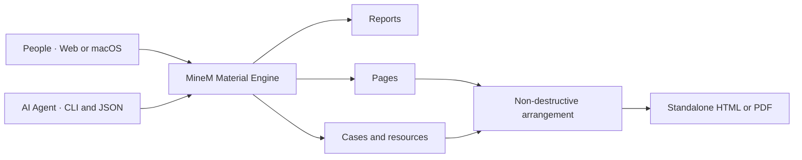

<div align="center">


# MineM

**让人和 AI 一起创建、复用、追溯并编排汇报素材。**

**A local-first material system where people and AI build presentations together.**

[](https://github.com/Jo-Tsu/minem/releases)
[](https://github.com/Jo-Tsu/minem/actions/workflows/ci.yml)
[](https://github.com/Jo-Tsu/minem/actions/workflows/codeql.yml)
[](LICENSE)

[中文](#中文) · [English](#english) · [快速开始](#五分钟开始使用) · [文档](docs/README.md) · [参与贡献](CONTRIBUTING.md)

</div>

MineM 是一个本地优先的开源汇报素材平台。它不只是保存文件，而是把完整汇报、
单页、案例和媒体资源组织成彼此关联的素材资产，让团队可以持续复用、追踪来源、
管理版本、重新编排并导出新的汇报。任何能够执行命令行的 AI Agent 都可以通过
MineM CLI 创建页面、生成汇报、插入或替换页面，并把结果纳入同一套素材管理体系。

MineM is a local-first, open-source presentation material platform. It turns
complete reports, individual pages, cases, and media resources into connected
assets that teams can reuse, trace, version, arrange, and export. Any AI agent
that can run shell commands can use the JSON CLI to create and manage material.



## 中文

### AI 可以真正操作素材，而不只是给建议

MineM 把平台能力封装为稳定的 CLI 和 JSON 返回值。AI 模型负责理解用户意图、
提炼文档和生成页面 HTML，MineM 负责完成可验证的产品动作：安全导入、正确分类、
生成编号、创建缩略图、保存来源、建立版本、编排汇报并返回真实预览链接。

它不绑定某一家模型。Codex、Claude Code、Gemini CLI 或任何能够执行 Shell 命令的
Agent，都可以调用同一套能力：

```bash
# 1. AI 生成单页 HTML 后，创建并命名页面素材；等待真实入库完成
python3 scripts/minem_cli.py --json page create \
  --file ./generated-page.html --title "客户案例：交付成果" --wait

# 2. 用多个页面素材创建一份完整汇报
python3 scripts/minem_cli.py --json report create \
  --title "2026 制造业解决方案" --controls <CTRL_ID_1>,<CTRL_ID_2>

# 3. 把新页面插入指定页面之后；正式汇报会应用新的编排
python3 scripts/minem_cli.py --json report page <REPORT_ID> \
  --add <NEW_CTRL_ID>:<AFTER_CTRL_ID> --yes

# 4. 修改某页时创建新页面版本，再替换当前汇报中的旧页
python3 scripts/minem_cli.py --json report page <REPORT_ID> \
  --replace <OLD_CTRL_ID>:<NEW_CTRL_ID> --yes

# 5. 把 Markdown 文档提炼为案例页面素材
python3 scripts/minem_cli.py --json case create \
  --file ./customer-story.md --title "制造业协同案例" --industry 制造业 --wait
```

`--wait` 会等待导入完成，并返回最终 `assetId`、素材编号、名称和可访问预览链接；
`--json` 让 Agent 可以稳定解析结果；`--yes` 用于确认会修改正式汇报的操作。原始
页面和旧版本不会因插入或替换而被删除。

完整命令边界见 [MineM CLI 能力范围](docs/MineM_CLI_能力范围.md)。这套端到端链路
已经进入 GitHub CI，每次提交都会真实创建页面与案例、生成汇报、插入和替换页面，
并验证正式预览链接。

### 为什么需要 MineM

多数汇报管理停留在文件层：文件散落在文件夹里，同一页面被反复复制，来源和版本
逐渐失去记录，想复用几页内容时又必须打开多份旧汇报重新寻找。MineM 把管理单位
从“文件”下沉到“页面和资源”，让每次汇报生产都能沉淀为下一次可直接使用的资产。

MineM 重点解决这些问题：

- **从整份汇报到单页资产**：导入多页 HTML 或 ZIP 汇报包后，完整汇报和每个独立
  页面会进入对应素材层级，不再混在同一个列表里。
- **来源关系不会丢失**：页面、资源、案例与汇报保留引用和生成关系，能够回答
  “这页来自哪里、被哪些汇报使用”。
- **编排不破坏原始素材**：排序、插入、隐藏只改变当前汇报的页面编排，不会删除
  页面素材，也不会覆盖已有版本。
- **预览规则保持一致**：平台统一处理画布尺寸、缩放、翻页、全屏和链接打开逻辑，
  减少不同来源页面出现空白、裁切或重复控件。
- **本地数据由自己掌控**：SQLite 数据库和导入素材默认保存在本机，不要求注册
  云端账号，也不会自动扫描未授权目录。
- **可接入自动化能力**：CLI、Agent 运行时和数据治理脚本可以支持后续 AI 工作流，
  同时保留人工确认和非破坏性操作边界。

### 它不是什么

MineM 不是另一套 PPT 绘图工具，也不是把所有页面重新截图保存。它位于汇报生产
链路的资产管理层，负责接住已有页面、外部汇报和案例内容，整理关系并形成可以持续
复用的素材库。页面仍可保留原始 HTML、图片、视频和 GIF 等表现形式。

### 适合这些场景

| 场景 | MineM 带来的价值 |
| --- | --- |
| 经常制作经营汇报、项目汇报或客户方案 | 从历史汇报快速找到并复用高质量页面 |
| 多人维护品牌、产品或咨询材料 | 统一入口、预览规则、版本和来源关系 |
| 一份汇报需要组合多个项目的页面 | 通过非破坏性编排插入、排序和隐藏页面 |
| 外部 HTML 汇报需要进入内部素材库 | 保留完整汇报，同时拆分为独立页面素材 |
| 对资料隐私和本地存储有要求 | 不依赖云端账号，数据目录完全由使用者控制 |
| 希望通过 AI 或 CLI 调用素材能力 | 使用结构化接口完成导入、创建、替换和治理 |

### 核心能力

| 能力 | 说明 |
| --- | --- |
| 汇报素材 | 保存完整多页汇报，支持预览、收藏、编排、重命名和导出 |
| 页面素材 | 每条记录严格对应一页，可独立查看、搜索、复用和管理版本 |
| 案例素材 | 将多个相关案例页面组织成案例组，并可插入新的汇报 |
| 资源素材 | 管理图片、视频、GIF、Logo 等页面依赖，识别重复内容和版本 |
| 故事线 | 将汇报收藏为可查看、可保留历史版本的叙事线索 |
| 统一预览 | 统一尺寸适配、翻页、全屏、刷新和链接复制入口 |
| 汇报编排 | 调整顺序、批量插入或隐藏页面，确认后应用到真实汇报链接 |
| 导出交付 | 导出可独立打开的 HTML 包或等待页面稳定后的 PDF |
| 数据治理 | 检查重复、失效路径、错误层级、缺失资源和异常预览 |
| 桌面入口 | 提供 macOS 客户端与快捷浮窗源码，网页和客户端均可使用 |

### 五分钟开始使用

#### 方式一：轻量本地启动

需要 Python 3.12、Node.js `^20.19.0` 或 `>=22.12.0`，然后执行：

```bash
git clone https://github.com/Jo-Tsu/minem.git
cd minem
./start.sh
```

启动器会按需创建 `.venv`、安装依赖、构建前端并打开浏览器。访问：
<http://127.0.0.1:8790/>

#### 方式二：Docker

```bash
git clone https://github.com/Jo-Tsu/minem.git
cd minem
docker compose up -d --build
```

Docker 默认使用空素材库，不扫描任何本机目录。需要导入外部资料时，复制
`docker-compose.override.example.yml` 为 `docker-compose.override.yml`，并显式
设置 `MINEM_IMPORT_ROOT`。来源目录将以只读方式挂载。

#### 手工启动

```bash
python3 -m venv .venv
source .venv/bin/activate
python3 -m pip install -r requirements.txt
npm ci
npm run build
python3 server.py
```

### 数据与隐私

MineM 采用源码与运行数据分离的结构。首次启动创建的 `data/`、`uploads/`、
`extracted/`、`thumbnails/`、`report-exports/` 和 `artifacts/` 都是本地状态，
已经从 Git 提交和 Docker 构建上下文中排除。

公开仓库不包含用户数据库、客户材料、导入汇报、预览图、模型权重、音频、桌面
安装包或本机路径配置。完整规则见[公开版本边界](docs/OPEN_SOURCE_RELEASE.md)。

### 开源承诺

MineM 不是需要许可证密钥才能解锁功能的 Open Core 项目。仓库中的平台源码依据
[Apache License 2.0](LICENSE) 完整开放：任何人都可以免费用于个人或商业项目，
可以修改、私有部署和再发布，不需要 MineM 账号、付费订阅或额外授权。使用和分发
时只需遵守 Apache-2.0 的标准许可证及声明保留要求。

### 项目结构

| 路径 | 作用 |
| --- | --- |
| `frontend/` | React + TypeScript 前端源码 |
| `minem/` | Python 领域模块与数据访问 |
| `server.py` | 本地 HTTP 服务入口和兼容路由 |
| `desktop/` | macOS 桌面客户端与快捷浮窗源码 |
| `templates/` | 平台运行时 HTML 模板 |
| `scripts/` | 测试、校验、治理、版本和 CLI 工具 |
| `docs/` | 产品、技术、设计、测试与发布文档 |

### 开发与贡献

```bash
npm run check
python3 -m compileall -q minem scripts server.py
python3 scripts/check_public_boundary.py
python3 scripts/check_repository_docs.py
python3 scripts/version_control.py check
```

涉及真实数据治理的脚本必须先以只读模式运行，只有明确确认后才使用 `--apply`。

- [文档索引](docs/README.md)
- [贡献指南](CONTRIBUTING.md)
- [支持说明](SUPPORT.md)
- [安全策略](SECURITY.md)
- [社区行为准则](CODE_OF_CONDUCT.md)
- [第三方软件声明](THIRD_PARTY_NOTICES.md)

## English

### AI operates the material system instead of only suggesting changes

MineM exposes product capabilities through a stable CLI with JSON output. The
model interprets intent, extracts documents, and generates page HTML. MineM
performs the verifiable product operations: safe import, classification, IDs,
previews, lineage, versions, report arrangement, and real preview URLs.

MineM is model-agnostic. Codex, Claude Code, Gemini CLI, or any agent that can
run shell commands can use the same workflow:

```bash
# Create and name a page material, then wait for the final asset
python3 scripts/minem_cli.py --json page create \
  --file ./generated-page.html --title "Customer outcome" --wait

# Create a report from existing page material IDs
python3 scripts/minem_cli.py --json report create \
  --title "2026 Manufacturing Solution" --controls <CTRL_ID_1>,<CTRL_ID_2>

# Insert a page after an existing report page
python3 scripts/minem_cli.py --json report page <REPORT_ID> \
  --add <NEW_CTRL_ID>:<AFTER_CTRL_ID> --yes

# Replace one report page with a newly created version
python3 scripts/minem_cli.py --json report page <REPORT_ID> \
  --replace <OLD_CTRL_ID>:<NEW_CTRL_ID> --yes

# Turn a Markdown document into a case page material
python3 scripts/minem_cli.py --json case create \
  --file ./customer-story.md --title "Manufacturing collaboration case" --wait
```

`--wait` returns the final asset ID, code, title, and working preview URL.
`--json` provides machine-readable results, while `--yes` explicitly confirms
operations that update a formal report. Insert and replace operations never
delete the source page or its previous versions.

See the [MineM CLI capability scope](docs/MineM_CLI_能力范围.md). The complete
workflow runs in GitHub CI and creates pages, case material, and a report before
testing insert, replace, and the final public preview.

### Why MineM

Most presentation libraries stop at the file level. Reports are scattered
across folders, the same page is copied repeatedly, and source and version
history disappear over time. MineM moves the unit of management from files to
pages and resources, so every presentation can become reusable material for
the next one.

- **Reports become page-level assets:** importing a multi-page HTML or ZIP
  package keeps the complete report while creating correctly classified,
  independent page materials.
- **Lineage stays visible:** reports, pages, cases, and resources preserve
  reference and generation relationships.
- **Arrangement is non-destructive:** reorder, insert, or hide pages without
  deleting page materials or replacing existing versions.
- **Preview behavior is consistent:** one canvas-fitting, navigation,
  fullscreen, refresh, and link-opening model handles different sources.
- **Your data remains local:** SQLite data and imported materials stay on the
  machine by default, with no cloud account or implicit directory scanning.
- **Automation remains optional:** CLI, Agent runtime, and governance tools can
  power AI workflows while preserving explicit confirmation boundaries.

### What MineM is not

MineM is not another slide drawing application, and it does not flatten every
page into a screenshot. It is the material system between existing content and
new presentation delivery. Original HTML, images, video, GIF, and other media
can remain part of the page.

### Designed for

| Scenario | Value |
| --- | --- |
| Recurring business, project, or client reports | Find and reuse strong pages from previous work |
| Teams maintaining brand, product, or consulting content | Share one entry point, preview model, lineage, and version history |
| Reports assembled from several projects | Insert, reorder, and hide pages non-destructively |
| External HTML reports entering an internal library | Preserve the full report and create independent page materials |
| Privacy-sensitive or local-only environments | Run without a cloud account and control every data directory |
| AI or CLI-driven material operations | Use structured import, create, replace, and governance capabilities |

### Core capabilities

| Capability | Description |
| --- | --- |
| Reports | Preview, favorite, arrange, rename, and export complete multi-page reports |
| Pages | Keep each record to one page, with independent viewing, search, reuse, and versions |
| Cases | Organize related case pages into reusable case groups |
| Resources | Manage image, video, GIF, and Logo dependencies with duplicate and version handling |
| Storylines | Preserve report collections as viewable, versioned narrative threads |
| Unified preview | Apply one canvas, navigation, fullscreen, refresh, and copy-link model |
| Arrangement | Reorder, insert, or hide pages and apply the confirmed result to the real report |
| Delivery | Export standalone HTML packages or stable, fully loaded PDF output |
| Governance | Audit duplicates, invalid paths, wrong hierarchy, missing resources, and broken previews |
| Desktop access | Build the macOS client and quick-command window from source |

### Start in five minutes

#### Lightweight local startup

Install Python 3.12 and Node.js `^20.19.0` or `>=22.12.0`, then run:

```bash
git clone https://github.com/Jo-Tsu/minem.git
cd minem
./start.sh
```

The launcher creates `.venv` when needed, installs dependencies, builds the
frontend, starts MineM, and opens <http://127.0.0.1:8790/>.

#### Docker

```bash
git clone https://github.com/Jo-Tsu/minem.git
cd minem
docker compose up -d --build
```

Docker starts with an empty library and scans no host directory. To mount an
external source, copy `docker-compose.override.example.yml` to
`docker-compose.override.yml` and set `MINEM_IMPORT_ROOT` explicitly. The
source is mounted read-only.

#### Manual startup

```bash
python3 -m venv .venv
source .venv/bin/activate
python3 -m pip install -r requirements.txt
npm ci
npm run build
python3 server.py
```

### Data and privacy

MineM separates source code from runtime data. `data/`, `uploads/`,
`extracted/`, `thumbnails/`, `report-exports/`, and `artifacts/` are local
state and are excluded from Git and the public Docker build context.

The repository contains no user database, customer content, imported report,
generated preview, model weight, audio, desktop installer, or machine-local
path configuration. See the [release boundary](docs/OPEN_SOURCE_RELEASE.md).

### Open-source commitment

MineM is not an Open Core product that requires a license key to unlock the
platform. The source in this repository is available under the
[Apache License 2.0](LICENSE). Anyone may use it for personal or commercial
work, modify it, self-host it privately, and redistribute it without a MineM
account, paid subscription, or separate permission. Standard Apache-2.0
license and notice preservation requirements still apply.

### Repository layout

| Path | Purpose |
| --- | --- |
| `frontend/` | React and TypeScript frontend source |
| `minem/` | Python domain modules and data access |
| `server.py` | Local HTTP service and compatibility routes |
| `desktop/` | macOS desktop client and quick-command window source |
| `templates/` | Runtime HTML templates |
| `scripts/` | Tests, validation, governance, versioning, and CLI tools |
| `docs/` | Product, technical, design, testing, and release documents |

### Development and contribution

```bash
npm run check
python3 -m compileall -q minem scripts server.py
python3 scripts/check_public_boundary.py
python3 scripts/check_repository_docs.py
python3 scripts/version_control.py check
```

Run data-governance tools in read-only mode first. Use `--apply` only after
reviewing the proposed changes.

- [Documentation index](docs/README.md)
- [Contributing guide](CONTRIBUTING.md)
- [Support](SUPPORT.md)
- [Security policy](SECURITY.md)
- [Code of Conduct](CODE_OF_CONDUCT.md)
- [Third-party notices](THIRD_PARTY_NOTICES.md)

## 许可证 / License

MineM 源码依据 [Apache License 2.0](LICENSE) 发布，可免费用于个人与商业用途，
也可修改、私有部署和再发布。MineM source code is available under the
[Apache License 2.0](LICENSE) for personal use, commercial use, modification,
private deployment, and redistribution.
