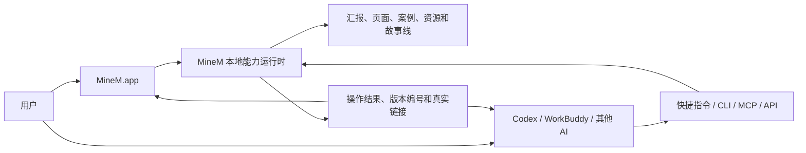

# MineM 本地 AI 客户端 PRD

> 文档状态：草案，待产品确认后进入实现
> 目标版本：MineM vNext
> 更新日期：2026-07-19
> 关联文档：[现有 macOS 客户端 PRD](macos-desktop-client-prd.md)、[CLI 能力范围](MineM_CLI_%E8%83%BD%E5%8A%9B%E8%8C%83%E5%9B%B4.md)

## 1. 产品定位

MineM 本地客户端不是网页的简单封装，而是 **MineM 本地能力运行时与 AI 操作中心**。

用户只安装一个 `MineM.app`，客户端负责启动和管理 MineM 的运行环境、素材数据、预览渲染和能力接口。Codex、WorkBuddy 及其他 AI 产品可以通过快捷指令、CLI、MCP 或本地 API 调用同一套 MineM 能力。

产品关系为：

核心原则：**一个 MineM 客户端，多个 AI 入口，一套统一素材能力。**

## 2. 背景与问题

MineM 已具备素材库、导入、页面编排、预览、导出、故事线和创作助手等能力，但用户仍可能遇到以下门槛：

1. 本地运行依赖 Python、前端构建、渲染器、数据库和文件目录，环境配置不应暴露给普通用户。
2. 用户与 AI 协作时，需要反复说明应该使用什么工具、操作哪个汇报、引用哪张页面和遵守哪些版本规则。
3. 不同 AI 产品的调用方式不同，容易形成多套指令和行为标准。
4. 写操作缺少统一的校验、人工确认、幂等和结果回传协议时，可能产生重复导入、错误归类或覆盖旧版本。
5. 客户端升级不能影响用户素材、页面引用、汇报编排和历史版本。

## 3. 产品目标

### 3.1 核心目标

1. 用户通过一个 `.dmg` 完成安装，首次打开自动准备全部必要环境。
2. 用户无需安装或操作 Docker、Python、Node、数据库和系统 Chrome。
3. 客户端启动后，网页端、客户端和 AI 工具访问同一套本地数据与能力。
4. 快捷浮窗帮助用户快速生成包含真实编号、链接、目标页和业务约束的 AI 操作包。
5. 为 Codex、WorkBuddy 和其他 AI 产品提供稳定的 CLI、MCP、本地 API 与深度链接入口。
6. 所有写操作可追踪、可验证、可幂等；覆盖、删除和批量变更必须人工确认。
7. 应用升级只更新程序与内置能力，不覆盖用户数据。

### 3.2 成功指标

- 干净 macOS 设备离线安装后，首次启动成功率不低于 99%。
- 用户不打开终端即可完成初始化并进入 MineM 首页。
- AI 操作请求的素材编号、页面链接和结果链接可追溯率为 100%。
- 同一幂等键重复提交不会生成重复汇报、页面或资源。
- 客户端升级后用户数据、页面引用和历史版本保留率为 100%。
- 高风险操作未经用户确认不得执行。

## 4. 用户与场景

| 用户 | 核心场景 | 期望结果 |
| --- | --- | --- |
| 汇报创作者 | 导入外部汇报、创建汇报、插入或替换页面 | 不理解技术环境也能完成工作，旧版本被保留 |
| 页面创作者 | 从零创建、复制或修改页面素材 | 单页归类正确，生成真实页面编号和链接 |
| 案例运营者 | 从外部文档提炼案例组和案例页面并插入汇报 | AI 负责提炼，MineM 负责入库、引用和版本管理 |
| AI 重度用户 | 从 Codex、WorkBuddy 等工具调用 MineM | 使用同一套能力定义，不重复描述底层命令 |
| 管理员 | 安装、升级、诊断和迁移客户端 | 不丢数据，能够查看初始化和操作日志 |

## 5. 产品边界

### 5.1 MineM 负责

- 本地服务、数据库、文件资源、预览渲染和导入导出环境。
- 汇报、页面、案例、资源、故事线的数据模型与业务规则。
- 能力目录、参数校验、人工确认、幂等执行和结果回传。
- 客户端导航、快捷浮窗、CLI、MCP、本地 API 和深度链接。
- 内置资源库与用户资源库的分层、升级和去重。

### 5.2 AI 产品负责

- 理解用户自然语言意图。
- 规划调用步骤、生成页面内容和提出修改方案。
- 通过 MineM 提供的稳定接口执行操作。
- 向用户解释执行结果或待确认事项。

### 5.3 非目标

- 首版不在 MineM 安装包中内置通用大模型或第三方 AI 账号。
- 首版不替代 Codex、WorkBuddy 等 AI 产品的对话界面。
- 不允许 AI 绕过 MineM API 直接修改 SQLite 或用户素材文件。
- 不把用户私有素材打入公开安装包。
- 不因桌面化改变既有素材生成内容和生成方式。

## 6. 核心体验

### 6.1 安装与首次启动

1. 用户安装并打开 `MineM.app`。
2. 客户端创建用户数据目录，检查应用架构和资源包完整性。
3. 客户端自动初始化数据库、内置资源库、运行时和预览渲染环境。
4. 初始化界面依次显示“准备环境、初始化资源库、校验预览、完成”。
5. 初始化中断后，下次启动从未完成步骤继续，不重复写入数据。
6. 初始化完成后进入 MineM 工作台；后续启动跳过已完成步骤。

### 6.2 日常启动

1. 客户端确保本机只运行一个 MineM 服务实例。
2. 健康检查通过后打开主界面。
3. 服务异常时显示可理解的原因、重试和诊断日志入口，不显示空白页。
4. 客户端退出时正常回收由本次客户端启动的子进程。

### 6.3 AI 快捷浮窗

快捷浮窗只保留“汇报”和“页面”两个模式，不设置素材模式。

用户可以：

- 从菜单栏或全局快捷键唤起浮窗。
- 读取当前 MineM 页面、粘贴页面链接或输入素材编号。
- 选择导入、新建、插入、替换、修改、复制、案例提炼等动作。
- 补充自然语言要求。
- 复制结构化操作包到任意 AI 产品。
- 保存最多 30 条自定义快捷指令模板。

浮窗首版不强制绑定某个 AI 产品，也不读取其他应用的历史信息。

### 6.4 AI 调用闭环

1. 用户或 AI 选择 MineM 能力。
2. MineM 校验素材类型、编号、链接、目标页和版本规则。
3. 只读或低风险操作直接执行。
4. 删除、覆盖、批量替换和正式编排等高风险操作进入人工确认。
5. MineM 使用幂等键执行操作并记录审计日志。
6. MineM 返回状态、生成/更新的编号、真实链接、版本和验证结果。
7. AI 将结果解释给用户，用户可通过 `minem://` 链接回到客户端对应页面。

## 7. 首版能力目录

| 能力域 | 首版动作 | 必要结果 |
| --- | --- | --- |
| 导入 | 导入外部汇报、导入单页材料、查询任务 | 汇报编号、每页页面编号、真实预览链接、去重结果 |
| 汇报 | 创建、查看页面、插入、替换、修改、编排、隐藏、导出 | 新版本、页面顺序、正式汇报链接、验证状态 |
| 页面 | 从零创建、复制生成、修改、查看版本 | 单页编号、新版本、页面链接、尺寸验证 |
| 案例 | 文档提炼、创建案例组和页面、插入汇报 | 案例组编号、页面编号、插入结果 |
| 素材 | 按编号、名称、标签和链接搜索，打开详情 | 正确素材类型、详情链接和引用关系 |
| 系统 | 健康检查、能力发现、日志导出、版本查询 | 运行状态、能力版本和诊断信息 |

业务规则沿用 MineM 主 PRD：页面素材只能包含一页，多页材料归类为汇报或案例；插入和替换不删除页面素材；修改生成新版本，不覆盖历史版本。

## 8. 多 AI 接入方式

### 8.1 快捷操作包

适用于所有支持粘贴文本的 AI 产品，是最低接入门槛。操作包同时包含结构化 JSON 与简短中文约束，避免 AI 猜测素材类型和操作规则。

### 8.2 MineM CLI

适用于 Codex、终端 Agent 和自动化脚本。CLI 必须提供稳定的 JSON 输出、明确退出码、幂等键和人工确认参数，不要求调用方了解后端路由。

### 8.3 MineM MCP

适用于支持 MCP 的 AI 产品。AI 可以发现 MineM 工具及参数定义，并通过同一能力网关执行，不重新实现业务逻辑。

### 8.4 本地 API

适用于 WorkBuddy 类客户端、内部自动化和后续插件。API 只监听本机地址，使用客户端生成的访问令牌，并与网页会话区分权限。

### 8.5 深度链接

MineM 注册 `minem://` 协议，用于从 AI 执行结果打开指定汇报、页面、任务、编排或诊断页。深度链接只负责导航，不通过 URL 静默执行写操作。

## 9. 操作包与结果规范

每个操作包至少包含：

- 协议版本、请求 ID 和幂等键。
- 调用来源与期望能力。
- 汇报、页面、案例或来源文档引用。
- 目标页、页面顺序和自然语言要求。
- 是否仅预检、是否需要人工确认。
- 页面单页、多页归类、版本不覆盖和真实链接校验规则。

执行结果至少包含：

- `queued`、`validating`、`awaiting_confirmation`、`running`、`succeeded`、`failed` 或 `cancelled` 状态。
- 新增或更新的素材编号、版本编号和真实链接。
- 实际变更摘要、未执行事项和验证结果。
- 错误代码、可理解的错误说明和可重试标识。

## 10. 人工确认与安全

以下动作必须在 MineM 客户端中确认：

- 删除汇报、页面、案例或资源。
- 覆盖式写入、批量替换和正式编排生效。
- 合并可能影响既有引用的重复素材。
- 导入来源不可信或素材类型无法确定。
- AI 请求访问 MineM 工作目录之外的本机文件。

确认页必须展示操作对象、影响数量、保留的旧版本和执行后的预期结果。确认令牌一次有效并有有效期，不能被 AI 重复使用。

## 11. 内置资源库与用户资源库

MineM 安装包可以包含经过白名单筛选的内置资源包，包括官方模板、默认页面、示例案例、图标和快捷指令。

- 内置资源标记为只读，并记录资源包版本与内容哈希。
- 用户导入和创建的数据写入用户资源库。
- 用户修改内置素材时创建用户版本，不覆盖内置原件。
- 内置资源升级按稳定 ID 与内容哈希合并，不生成重复数据。
- 当前工作区中的用户上传、数据库、缩略图和私有原始文件不得直接打入安装包。

## 12. 升级与数据保留

- 应用程序、运行时、数据库迁移和内置资源包分别记录版本。
- 覆盖安装新 `.app` 不删除 `~/Library/Application Support/MineM/`。
- 数据库迁移必须可回滚，并在启动前创建轻量备份。
- 资源包更新不得覆盖用户版本或改变既有汇报引用。
- 初始化或升级失败时继续使用上一个完整版本，不能留下半初始化数据。
- 卸载应用默认保留用户数据；删除用户数据必须单独确认。

## 13. 非功能要求

### 性能

- 已完成初始化的日常启动应在 5 秒内显示可操作界面；服务恢复过程提供进度状态。
- 快捷浮窗应在 300 毫秒内显示，不加载素材卡片和缩略图列表。
- CLI/MCP 能力发现应在 1 秒内返回。
- 导入、预览、导出等耗时任务异步执行，不阻塞主界面。

### 兼容

- 首版支持 Apple Silicon；Intel 版本是否同时发布在正式构建前确认。
- 浏览器访问方式继续保留，并与客户端使用同一业务 API。
- AI 接入不得依赖某一家模型或某一家客户端的私有协议。

### 可观测

- 记录客户端启动、首次初始化、服务生命周期、能力调用、确认和错误日志。
- 日志不得记录用户文档正文、令牌和完整剪贴板内容。
- 用户可一键导出脱敏诊断包。

## 14. P0 需求清单

| 编号 | 需求 | 验收标准 |
| --- | --- | --- |
| LAI-01 | 单一安装包 | 干净 Mac 无外部运行环境也可安装和启动 |
| LAI-02 | 首次启动初始化 | 可恢复、幂等，不生成重复数据 |
| LAI-03 | 本地服务托管 | 单实例、健康检查、异常重试和正常回收 |
| LAI-04 | 内置渲染环境 | 无系统 Chrome 时仍可生成预览和导出 |
| LAI-05 | 内置资源包 | 资源完整、可校验、可升级且不覆盖用户数据 |
| LAI-06 | 快捷浮窗 | 可收集真实引用并复制结构化 AI 操作包 |
| LAI-07 | CLI | 核心能力具有稳定 JSON 输入输出和退出码 |
| LAI-08 | MCP | 支持能力发现、预检、执行和状态查询 |
| LAI-09 | 本地 API 安全 | 仅本机访问，令牌鉴权，高风险操作需确认 |
| LAI-10 | 深度链接 | AI 结果可打开 MineM 对应内容，不静默执行写操作 |
| LAI-11 | 数据升级保护 | 覆盖安装后用户数据、版本和引用全部保留 |
| LAI-12 | 审计与诊断 | 每次 AI 写操作可追踪，可导出脱敏诊断信息 |

## 15. 验收场景

1. 在未安装 Python、Node、Docker、Chrome 的干净 Mac 上断网安装并首次启动。
2. 首次初始化中途退出，重新打开后继续完成且数据库无重复素材。
3. 从快捷浮窗生成“替换汇报第 6 页”的操作包，在 Codex 中调用并返回新版本链接。
4. 支持 MCP 的 AI 发现 MineM 能力，完成一次页面创建和一次汇报插入。
5. 未确认删除操作时，AI 无法获得有效执行结果。
6. 重复提交相同导入请求，只返回已有素材或版本关系，不创建重复记录。
7. 覆盖安装新版本后，用户素材、汇报编排和历史版本保持不变。
8. 点击 AI 返回的 `minem://` 链接，客户端打开正确素材详情或任务状态。

## 16. 实施阶段

1. **文档与协议确认**：确认本 PRD、技术方案、能力名称和风险边界。
2. **一体化运行时**：完成首次启动引擎、内置渲染环境、资源包和升级机制。
3. **统一能力网关**：整理本地 API，补齐幂等、预检、确认和审计。
4. **多 AI 接入**：发布稳定 CLI、MCP 和深度链接；升级快捷浮窗。
5. **发布与验收**：签名、公证，在干净设备执行完整离线验收。

## 17. 待确认决策

1. 首版是否同时发布 Apple Silicon 与 Intel 安装包。
2. 内置资源包首版包含哪些官方模板和示例，是否允许随安装包公开分发。
3. 首版是否交付 MCP 直接执行，还是先交付 MCP 预检与只读查询。
4. WorkBuddy 等不支持 MCP 的产品是否采用本地 API 适配器，或先使用快捷操作包。
5. 是否允许客户端在后台常驻，以保证 CLI/MCP 随时可用。
