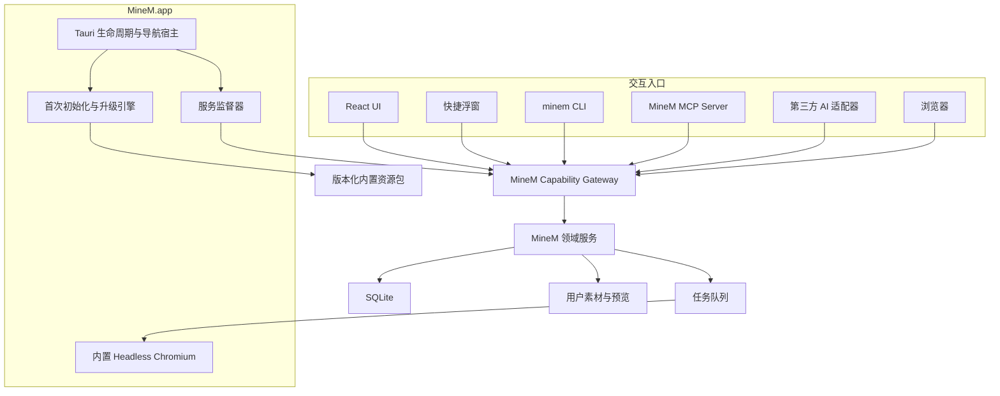

# MineM 本地 AI 客户端技术设计

> 文档状态：草案，待技术与产品确认后实施
> 目标版本：MineM vNext
> 更新日期：2026-07-19
> 关联文档：[本地 AI 客户端 PRD](MineM_LOCAL_AI_CLIENT_PRD.md)、[现有 macOS 客户端技术设计](macos-desktop-client.md)

## 1. 技术目标

构建一个可离线安装、自带运行环境、自动初始化、可安全升级的 macOS 客户端，并把 MineM 的业务能力通过统一能力网关提供给：

- MineM React 主界面。
- MineM 桌面快捷浮窗。
- MineM CLI。
- MineM MCP Server。
- WorkBuddy 类产品使用的本地 API 适配器。
- 浏览器访问和 `minem://` 深度链接。

所有入口必须复用同一业务服务，不允许各自直接写数据库或复制业务逻辑。

## 2. 当前基线与差距

| 范围 | 当前基线 | vNext 差距 |
| --- | --- | --- |
| 客户端 | Tauri 2 + macOS WebView | 缺少完整首次初始化与升级状态机 |
| 前端 | React 构建产物随客户端发布 | 继续复用，无需复制实现 |
| 后端 | `server.py` 与 `minem/` 通过 PyInstaller sidecar 打包 | 需要能力网关、鉴权、幂等和确认协议 |
| 快捷浮窗 | 已有菜单栏、全局快捷键和操作包复制 | 需要能力发现、结果回链与 AI 接入配置 |
| CLI | 已有 `scripts/minem_cli.py`，封装部分 HTTP API | 需要稳定协议、自动发现服务、认证和完整能力覆盖 |
| MCP | 尚未实现 | 需要新增本地 MCP Server，并复用能力网关 |
| 预览渲染 | `minem/thumbnails.py` 搜索系统 Chrome/Chromium | 需要随客户端打包固定渲染器，消除系统依赖 |
| 资源库 | 用户数据位于工作目录或 Application Support | 需要版本化内置资源包与用户资源覆盖层 |
| 升级 | `.app` 覆盖安装、用户目录保留 | 需要数据库迁移、资源包迁移、回滚和诊断 |

## 3. 目标架构



### 3.1 组件职责

- **Tauri 壳**：应用生命周期、窗口、标签、菜单栏、全局快捷键、深度链接和安全的原生命令。
- **Bootstrap Engine**：首次初始化、完整性校验、数据库迁移、内置资源导入和失败恢复。
- **Service Supervisor**：启动、发现、健康检查和回收 `minem-server`、MCP 与渲染进程。
- **Capability Gateway**：统一能力目录、参数校验、幂等、权限、确认、任务状态和审计。
- **Domain Services**：现有导入、汇报、页面、案例、资源、故事线、预览和导出逻辑。
- **Renderer Runtime**：固定版本的 Headless Chromium，仅负责截图、预览和需要浏览器渲染的导出。
- **Seed Pack Manager**：管理内置资源包版本、校验、导入与用户覆盖层。

## 4. 应用包与数据目录

### 4.1 应用包目标结构

```text
MineM.app/
  Contents/
    MacOS/
      MineM
      minem-server
      minem-cli
      minem-mcp
    Resources/
      frontend/
      templates/
      renderer/
      seed-packs/base-library-v1/
      manifests/
        runtime.json
        capabilities.json
        seed-packs.json
```

应用包内文件只读并参与签名。不得把用户数据库、上传文件、缩略图、导入绝对路径或私有材料写入 `.app`。

### 4.2 用户数据目录

```text
~/Library/Application Support/MineM/
  config/
    settings.json
    runtime.json
    ai-adapters.json
  data/
    minem.db
    backups/
  library/
    uploads/
    extracted/
    thumbnails/
    exports/
  packs/
    installed.json
  runtime/
    bootstrap-state.json
    service.json
    session-token
    locks/
    staging/
  logs/
```

- 数据目录权限为当前用户可读写，不要求管理员权限。
- `session-token` 权限限制为当前用户，并在服务重启时轮换。
- 临时文件先写入 `staging/`，验证成功后通过原子重命名发布。

## 5. 首次启动与恢复状态机

### 5.1 状态

```text
not_started
  -> verifying_bundle
  -> preparing_directories
  -> migrating_database
  -> installing_seed_pack
  -> validating_renderer
  -> validating_runtime
  -> ready
```

任一步骤失败进入 `failed`，记录 `failed_step`、错误码和可重试信息。再次启动从最近一个已提交步骤继续。

### 5.2 幂等规则

1. 每个步骤必须具有稳定步骤 ID、输入版本和完成校验。
2. 数据库迁移按迁移编号记录，重复执行不改变结果。
3. 内置资源按 `pack_id + stable_asset_id + content_hash` 导入。
4. 资源文件使用内容寻址或哈希索引，相同内容不重复复制。
5. 步骤在临时目录完成并校验后才写入完成标记。
6. `bootstrap-state.json` 只记录状态和版本，不记录用户素材内容。

### 5.3 启动锁

- 使用进程锁防止两个客户端同时初始化或迁移同一数据库。
- 已有健康服务时复用；端口被非 MineM 进程占用时选择新的本机端口，不停止其他进程。
- 服务地址写入 `runtime/service.json`，CLI/MCP 通过该文件发现，不硬编码 `8790`。

## 6. 内置资源包

### 6.1 包结构

```text
base-library-v1/
  manifest.json
  assets.jsonl
  files/
  previews/
  templates/
```

`manifest.json` 至少包含：

- `pack_id`、`version`、`schema_version`。
- 文件清单、大小、SHA-256 和签名。
- 素材数量、素材类型和依赖闭包摘要。
- 最低 MineM 版本和数据库版本。

### 6.2 双层资源模型

- 内置素材：`origin=builtin`、`read_only=true`、带 `pack_id` 和稳定 ID。
- 用户素材：`origin=user`、可编辑、独立版本链。
- 修改内置素材时创建用户版本，通过 `derived_from` 指向原素材。
- 内置资源包更新只新增或升级内置版本，不重写用户版本与引用。
- 资源依赖必须形成闭包；HTML 引用的图片、视频、GIF、字体和脚本必须全部存在并通过校验。

## 7. 服务监督与本地安全

1. `minem-server` 仅监听 `127.0.0.1`，默认使用动态可用端口。
2. Tauri 启动服务时传入数据目录、端口、会话令牌位置和渲染器路径。
3. `/api/health` 返回应用版本、数据库版本、能力协议版本和就绪状态。
4. 网页 UI 使用受限会话；CLI、MCP 和第三方适配器使用独立本地访问令牌。
5. 写请求需要 `Origin` 校验、访问令牌和幂等键；不得仅依赖 localhost 作为信任边界。
6. 服务日志、令牌和诊断数据不得被静态文件服务暴露。
7. AI 请求访问应用数据目录之外的文件时，必须通过原生文件选择或明确授权。

## 8. 统一能力网关

### 8.1 设计原则

- UI、CLI、MCP 和第三方适配器调用同一能力实现。
- 能力名称与后端 HTTP 路径解耦，后端重构不破坏 AI 接入。
- 所有写操作先校验，再根据风险等级决定直接执行或等待确认。
- 耗时操作统一返回任务 ID，并通过状态查询或事件流获取进度。
- 所有成功结果返回 MineM 编号、版本与真实可访问链接。

### 8.2 能力命名

```text
system.health
system.capabilities
asset.search
asset.open
import.report
import.page
task.get
report.create
report.pages
report.page.insert
report.page.replace
report.page.modify
report.arrange
report.export
page.create
page.duplicate
page.modify
page.versions
case.extract
```

### 8.3 操作协议

```json
{
  "schema": "minem.operation.v1",
  "requestId": "req_...",
  "idempotencyKey": "idem_...",
  "source": "codex",
  "capability": "report.page.replace",
  "input": {
    "reportRef": "RPT-20260714-001",
    "targetPage": 6,
    "pageRefs": ["CTRL-PAGE-031"]
  },
  "requirements": "保留旧页面素材",
  "dryRun": true
}
```

统一响应：

```json
{
  "ok": true,
  "status": "awaiting_confirmation",
  "requestId": "req_...",
  "taskId": "task_...",
  "confirmation": {
    "required": true,
    "token": "confirm_...",
    "expiresAt": "2026-07-19T12:00:00+08:00"
  },
  "impact": {
    "reports": 1,
    "pagesAdded": 0,
    "pagesReplaced": 1,
    "oldVersionsPreserved": true
  }
}
```

### 8.4 幂等与任务状态

- 同一调用方、能力和幂等键返回同一逻辑结果。
- 失败重试不得创建新的素材记录，除非调用方提供新的幂等键。
- 状态统一为 `queued`、`validating`、`awaiting_confirmation`、`running`、`succeeded`、`failed`、`cancelled`。
- 编排、导入和导出成功必须以真实产物校验完成为准，不以数据库写入完成为准。

## 9. CLI 设计

### 9.1 安装与发现

- `minem-cli` 随应用打包。
- 客户端可提供“安装命令行工具”，在用户授权后把稳定启动器链接到常用 PATH；也可直接使用应用包内路径。
- CLI 从 `runtime/service.json` 获取当前服务地址和令牌，不要求用户输入端口。
- MineM 未运行时，CLI 可通过 `minem://launch` 唤起客户端并等待服务就绪。

### 9.2 输出契约

- 默认输出人类可读摘要，`--json` 输出稳定 JSON。
- 成功退出码为 `0`；校验失败、待确认、执行失败和连接失败使用不同非零退出码。
- 高风险操作使用 `--dry-run` 预检；命令行中的 `--yes` 只适用于交互终端，AI 调用必须走客户端确认令牌。
- CLI 不直接读写 SQLite，不复制后端业务校验。

### 9.3 示例

```bash
minem report page replace RPT-20260714-001 \
  --target 6 \
  --page CTRL-PAGE-031 \
  --dry-run \
  --json
```

## 10. MCP Server 设计

- MCP Server 作为应用 sidecar 或由 `minem-cli mcp serve` 启动。
- 工具定义由 `capabilities.json` 生成，参数 schema 与能力网关保持一致。
- MCP 工具不直接调用数据库，只调用本地能力网关。
- 首版资源可暴露 MineM 素材详情、任务状态和能力说明；不得暴露整个用户目录。
- 写工具先返回影响预览；需要确认时返回 `awaiting_confirmation` 和可打开的 `minem://confirm/{requestId}`。
- AI 不能通过 MCP 参数伪造确认结果。

建议首批 MCP 工具：

```text
minem_health
minem_search_assets
minem_import_report
minem_import_page
minem_create_report
minem_list_report_pages
minem_insert_report_pages
minem_replace_report_page
minem_create_page
minem_duplicate_page
minem_modify_page
minem_extract_case
minem_get_task
minem_open
```

## 11. 快捷浮窗与第三方 AI 适配

### 11.1 快捷浮窗

- 继续使用独立轻量 WebView，不加载主 React 列表和缩略图。
- 从 MineM 当前标签、剪贴板和手动输入收集引用；不监听其他应用历史。
- 默认动作是复制 `minem.operation.v1` 操作包和简短中文指令。
- 后续可提供“发送到已配置 AI”入口，但必须通过显式适配器，不模拟键盘或绕过系统权限。

### 11.2 AI 适配器

适配器只负责协议转换和启动方式，不实现 MineM 业务逻辑：

- Codex：优先 CLI 或 MCP；快捷浮窗作为通用回退。
- WorkBuddy 类产品：优先 MCP；不支持 MCP 时使用本地 API 或复制操作包。
- 其他 AI：至少支持复制操作包；可按相同协议增加适配器。

适配器配置保存在本地，不随诊断包导出密钥。第三方 AI 凭证不进入 MineM 数据库。

## 12. 深度链接

建议协议：

```text
minem://open/report/RPT-20260714-001
minem://open/page/CTRL-PAGE-031
minem://open/task/task_123
minem://confirm/req_123
minem://launch
```

- `open` 和 `launch` 只导航或启动应用。
- `confirm` 打开 MineM 原生确认界面，用户确认后才提交令牌。
- 深度链接参数必须严格解析和转义，拒绝任意文件路径、脚本和外部 URL。
- 多次打开同一内容时复用或聚焦已有标签，避免无限创建窗口。

## 13. 预览与渲染运行时

当前预览代码会搜索系统 Chrome/Chromium，无法满足干净设备离线运行。vNext 采用固定版本 Headless Chromium 随应用发布：

1. 构建时写入版本、架构和 SHA-256。
2. 运行时只使用应用内渲染器，不搜索用户系统浏览器。
3. 渲染器只允许访问 MineM 本机服务和当前任务的资源闭包，默认禁用外部网络。
4. 缩略图、预览重建和 PDF 导出统一使用同一渲染版本。
5. 渲染失败返回资源缺失、页面脚本错误、超时或尺寸异常等结构化错误。
6. 渲染进程由任务队列限制并发，任务完成后回收，避免长期占用内存。

## 14. 数据库迁移与升级

### 14.1 版本

分别记录：

- `app_version`
- `runtime_version`
- `database_schema_version`
- `capability_protocol_version`
- `seed_pack_versions`

### 14.2 升级事务

1. 获取独占升级锁并停止写任务。
2. 校验新应用和资源清单。
3. 创建 SQLite 在线备份和配置快照。
4. 在事务中执行数据库迁移。
5. 在 staging 中安装或升级内置资源包。
6. 运行数据一致性、资源闭包和代表性预览校验。
7. 原子提交版本状态并恢复任务。
8. 失败时回滚数据库与资源包状态，保留诊断信息。

不得在应用启动路径中自动删除疑似重复或垃圾数据；数据治理只生成报告，写入修复需要独立确认。

## 15. 构建、签名与发布

### 15.1 构建流水线

1. 构建 React 前端和快捷浮窗。
2. 使用 PyInstaller 构建 `minem-server`、`minem-cli` 和 `minem-mcp`。
3. 下载或读取锁定版本的 Chromium，校验哈希和许可证。
4. 构建并签名内置资源包清单。
5. 构建 Tauri `.app`，签名所有可执行文件、框架和 sidecar。
6. 生成 `.dmg`，执行 Apple 公证和 stapling。
7. 在干净 macOS 账户执行离线冒烟测试。

### 15.2 架构策略

- Apple Silicon 与 Intel 优先生成独立安装包，降低单包体积和 sidecar 复杂度。
- 如后续提供 Universal 包，所有原生 sidecar、Chromium 和动态库必须同时支持双架构。
- 安装包大小由内置渲染器与资源包决定，首版记录并监控，不通过删除必要运行资源换取体积。

## 16. 性能与资源预算

| 指标 | 目标 |
| --- | --- |
| 已初始化冷启动到可操作界面 | 5 秒内，超时显示进度而非白屏 |
| 快捷浮窗显示 | 300 毫秒内 |
| CLI/MCP 健康检查 | 1 秒内 |
| 空闲状态额外内存 | 持续监控，渲染器不得常驻 |
| 初始化/升级 | 全程有进度，可中断恢复 |
| 耗时任务 | 异步执行，支持状态查询和取消 |

列表、缩略图和图谱等大数据不得在快捷浮窗或 MCP 能力发现阶段加载。

## 17. 日志、审计与诊断

- 客户端日志：启动、窗口、深度链接和服务监督。
- Bootstrap 日志：步骤、版本、耗时和失败原因。
- 能力审计：调用来源、能力、对象编号、风险等级、确认人、状态和结果编号。
- 后端日志：请求 ID、任务 ID、导入/渲染/导出错误。
- 诊断包默认脱敏，不包含令牌、素材正文、完整剪贴板、用户上传文件和外部 AI 凭证。

日志使用大小与保留时间轮转，避免 Application Support 无限增长。

## 18. 测试方案

### 18.1 自动测试

- Bootstrap 每一步的幂等、失败恢复和并发锁测试。
- 数据库迁移前进、回滚和旧版本兼容测试。
- 内置资源包哈希、依赖闭包、重复导入和覆盖层测试。
- 能力协议 schema、权限、幂等、确认令牌和错误码测试。
- CLI 与 MCP 对同一能力返回一致结果的契约测试。
- 深度链接解析和危险输入拒绝测试。
- 固定渲染器的尺寸、资源加载、截图和 PDF 测试。

### 18.2 干净设备验收

- 未安装 Python、Node、Docker、Chrome。
- 断网完成安装、初始化、导入、预览、页面创建和汇报导出。
- 初始化中断后恢复，不产生重复数据。
- 覆盖升级后用户素材、汇报编排、历史版本和自定义指令保留。
- 从 Codex 通过 CLI 或 MCP 完成一次创建、插入和结果回链。
- 从不支持 MCP 的 AI 通过快捷操作包完成同一业务闭环。

## 19. 实施顺序

1. **协议冻结**：确认 PRD、能力名称、操作 schema、风险等级和首批 MCP 工具。
2. **Bootstrap**：实现目录、锁、状态机、迁移与内置资源包。
3. **运行时补齐**：打包固定 Chromium，统一服务发现和会话令牌。
4. **能力网关**：将现有 API 收敛为稳定能力层，增加幂等、预检、确认和审计。
5. **CLI 与 MCP**：升级 CLI，新增 MCP Server 和深度链接。
6. **客户端体验**：升级快捷浮窗、初始化 UI、确认中心和诊断入口。
7. **发布验收**：签名、公证、干净设备离线测试和升级回滚演练。

## 20. 实现前必须确认

1. 首版正式支持的 macOS 最低版本和 CPU 架构。
2. 内置资源包的内容白名单与分发授权。
3. MCP 首版的写操作范围及风险等级。
4. 后台常驻策略，以及关闭主窗口时 CLI/MCP 是否继续运行。
5. 本地 API 第三方适配器的授权和令牌撤销方式。
