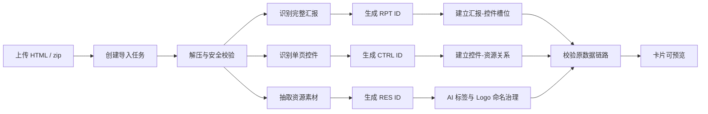

# MineM 素材工作台 PRD

版本：0.4.0 · 2026-07-19
产品定位：面向汇报 HTML 生成流程的本地素材资产库与复用工作台。

## 1. 背景

MineM 用于沉淀每一次汇报生成过程中的完整汇报、单页控件和基础资源。用户在生成新汇报时，可以按素材 ID、标签和来源批次快速复用已有内容，减少重复制作和素材错配。

当前产品已明确去掉旧“叙事逻辑框架”模块，保留“故事线”。故事线既包含可复用的汇报材料模板，也包含从汇报材料收藏生成的故事线记录。

当前 MineM 管理平台前端已迁移为 React + TypeScript + Vite。该迁移只影响平台操作体验和前端工程结构，不改变已生成素材、素材生成目录和素材生成方式。

### 平台与素材边界

MineM 源码与用户素材必须隔离：公开仓库只承载源码、文档、模板和可复现配置；运行数据库、导入副本、缩略图、导出产物和外部素材源保存在被 Git 忽略的运行目录或用户明确指定的仓库外目录。任何新功能不得把数据库、客户素材、临时任务、构建缓存或测试产物写入源码目录；自动扫描默认关闭，并且只能扫描用户显式配置的来源。

知识图谱已从当前产品范围中删除。平台不得保留或恢复图谱导航、页面、详情操作、后端接口、Agent 任务和自动计算；素材来源追溯继续由“原数据链路”独立承担。

## 2. 目标

1. 管理完整汇报素材：支持 HTML 预览，并可导出离线 HTML 包或 PDF。
2. 管理单页控件素材：每个控件对应汇报中的一页，可拼接成新的 HTML 汇报。
3. 管理资源素材：自动抽取图片、Logo、图标、GIF、视频、SVG，并支持标签编辑。
4. 支持异步导入：HTML 和 zip 均可入库，任务浮窗展示成功/失败，成功标准是可点击预览。
5. 支持数据治理：清理历史垃圾数据、旧编号、脏标题、孤儿关系和预览错位。
6. 保证预览一致：卡片、详情、打开链接必须指向同一条资产记录对应的真实文件。
7. 支持原数据链路可追溯：每个详情字段可点击，弹出关联数据列表与详情预览。
8. 素材详情弹窗采用“预览主区 + 常驻版本侧栏 + 收纳式操作”：顶部固定复制链接、刷新、全屏与关闭图标；命名、打开真实链接、复制 ID、删除收纳至更多菜单。右侧版本侧栏必须展示全部真实版本的小预览、版本号、更新时间与生成来源；点击版本立即切换左侧预览，不覆盖原始素材或引用关系。
9. 明确批次数据口径：批次产物按汇报、页面、控件、资源统计；页面数优先来自完整汇报入口解析，资源细分按资源类型聚合。
10. 统一前端设计规范：所有新增页面、弹窗和抽屉必须遵循 `docs/DESIGN_SYSTEM.md`。
11. 支持汇报收藏为故事线：汇报素材可新建故事线，或作为已有故事线的新版本；故事线可点击查看版本和来源材料；收藏不会新增汇报材料，也不会创建汇报版本。
12. 支持 AI 演讲台：汇报素材可导入演讲稿、飞书妙记转写、PDF、MD、TXT，系统清洗文本、按页面自动分页并写入演讲台；没有导入演讲稿的汇报不得显示自动占位稿。
13. 支持页面素材批量临时预览：用户多选页面素材后生成临时汇报链接，关闭页面后自动释放，不新增正式汇报资产。
14. 支持汇报编排：用户可从完整汇报预览的翻页控件进入页面编排视图，查看全部页面缩略图并人工调整顺序、隐藏或恢复页面；编排结果必须可预览、可追溯，且不破坏原汇报。
15. 统一所有多页预览的翻页与页面放大交互：以 `created-report-20260712-104126-cb5cb5e9a7` 的底部页码胶囊为基准，应用于汇报、页面素材批量临时预览、编排后预览、独立打开链接和案例多页预览。
16. 支持完整汇报导出：用户可导出当前已确认编排的完整汇报为离线 HTML 包或 PDF；导出不创建资产、不覆盖来源文件，也不改变页面或资源版本。
17. 标签体系以 `docs/MineM_TAG_SYSTEM_PRD.md` 为准：业务标签与类型、编号、版本、来源等结构化元数据分离；旧标签清理必须先输出只读审计清单并完成全量验收，项目运行目录不保留数据库副本。
18. 外部导入必须完成资源闭包校验：HTML 入口、拆分页面、嵌套 iframe、`data-fs-src`、`srcset`、样式表及 CSS `url()` 引用的本地资源均须存在后才可标记导入成功；缺失来源包中的图片、视频或其他二进制资源时，任务必须失败并列出缺失路径，不能产生空白预览素材。
19. 导入采用“隔离校验后发布”机制：上传文件先进入独立暂存区，完成类型识别计划、资源闭包、页面尺寸、真实浏览器渲染和缩略图验证后，才一次性发布为汇报、案例、页面或资源素材。失败任务不得写入正式素材、页面槽、资源关系或缩略图；重试同一内容必须复用同一内容指纹，不得重复生成卡片。多页汇报在显示“成功”前还必须完成页面槽位复核：解析出的每页都必须已有对应页面素材和当前汇报槽位引用；任意一页缺失时任务保持失败并说明“应生成页数/实际关联页数”，不得仅因汇报入口已创建而显示成功。
20. 外部导入重建规则：历史批次重建前必须输出引用清单和 dry-run 结果，并保留原始上传文件。重建只清理该批次派生的页面、候选页、适配页、资源关系和缩略图；不删除用户生成汇报、手工编排、故事线、原始文件或其他批次引用。项目运行目录不自动创建数据库副本；缺少原始二进制资源的批次保持失败状态，等待完整来源包重新导入。
21. 支持 macOS MineM 创作助手：仅提供汇报和页面两个模式，帮助用户采集当前汇报、目标页、页面链接/编号和外部来源，生成可复制给 Codex 类型工具的结构化操作包；助手不设置素材模式，也不直接执行平台写操作。

## 3. 用户角色

核心用户：汇报 HTML 生成者、素材整理者、售前/方案人员。

典型场景：
- 生成一份完整汇报后，将汇报、每页控件和页面资源统一入库。
- 并行生成多个页面控件后，挂载到同一个汇报素材下。
- 查找某个客户 Logo、图标、背景图或案例页，复用到新汇报中。
- 通过原数据链路查看一个汇报、页面或资源来自哪个批次，以及同批次的关联素材。
- 基于故事线模板快速复用目录结构，只替换案例素材。

## 4. 产品模块

### 4.1 工作台

默认首页。展示资产总览、主素材库入口、资源入口和素材生成链路。

关键要求：
- 默认显示平台概览，但导航主入口突出汇报素材。
- 顶部导航全部展开，主入口用短词表达：工作、汇报、页面、案例、资源、故事。
- 所有图标使用内置 SVG，避免字体缺失导致乱码。
- 不展示 mock 数据，不展示旧叙事框架入口。
- 视觉遵循 MineM 设计规范：顶部胶囊导航、浅蓝品牌锚点、克制卡片、稳定间距和统一 token。
- 工作台属于高频管理界面，不使用营销式 Hero；顶部统计与工作台总览不得重复展示同一组数据。主体只保留紧凑总览、可点击分类入口和最近素材。
- 一级模块切换后必须回到列表顶部，不能继承上一个模块的滚动位置。

### 4.2 汇报素材

定义：一次完整汇报的原始成果，是控件和资源的根节点。

字段：
- ID：`RPT-YYYYMMDD-NNN` 或带来源短码的 `RPT-GZXF-YYYYMMDD-NNN`
- 名称
- 场景/标签
- 页面数
- 版本
- 预览地址
- 来源批次

能力：
- 卡片预览完整汇报。
- 汇报卡片页数显示当前已确认编排中的可见页面数；来源文件识别页数仅保留在原数据链路中，不能覆盖卡片页数。
- 点开详情查看汇报信息、原数据链路、预览和顶部操作。
- 顶部支持打开完整汇报、复制链接、复制 ID、删除素材。
- 素材列表按页加载，筛选、搜索、切换类型时回到第一页，避免大批量素材拖慢首屏；主素材库默认每批加载 30 条，滚动后加载下一批。
- 所有素材列表按最近业务活动时间倒序排列；汇报素材取自身最近更新时间，页面素材取自身更新、版本新增或被汇报引用的最近时间，资源素材取自身新增、更新或复用时间。
- 资源素材页工具栏提供“导入外部资源”，支持导入外部 HTML、ZIP、图片、SVG、GIF 和视频，入库后解析为 MineM 可复用的汇报、控件或资源素材。
- 支持手动导入单页为控件素材。
- 支持“收藏为故事线”：每个汇报卡片和详情弹窗提供收藏入口；收藏时可选择“新建故事线”或“更新已有故事线版本”。
- 故事线记录关联来源汇报，故事线列表默认展示最新版本；详情可查看全部版本、来源汇报材料预览，并可跳转查看来源汇报。
- 支持 AI 演讲台：
  - 未导入演讲稿时，点击 AI 演讲台弹出导入页，用户可导入飞书妙记整理内容、演讲稿、PDF、MD、TXT，或基于页面信息生成演讲稿草稿。
  - 已导入演讲稿时，点击 AI 演讲台先弹出二选一：编辑演讲稿、进入演讲台。
  - 编辑页和导入页保持一致，保存后只更新演讲台讲稿，不改原汇报素材、页面素材和素材生成方式。
  - 演讲稿处理需要清洗会议纪要时间戳、无效 Markdown、重复空行，并结合每页标题、章节、页面表达信息自动分页。
  - 语速设置必须真实生效；语音播放不得明显卡顿；如果本地 TTS 不可用，应降级到系统语音。
  - 演讲台讲稿缓存必须按报告隔离，避免不同汇报串稿。
- 支持并行生成页面后回填到对应页码；该能力当前作为实验功能默认隐藏，避免干扰主流程。

#### 汇报编排

入口与范围：
- 在完整汇报预览的翻页/页码控件附近提供“编排”入口，仅对 `report` 类型且具备可解析页面的汇报显示。
- 点击后跳转至该汇报独立的页面编排页，保留明确的返回汇报入口；不以弹窗承载编排主工作流。
- 编排页的当前汇报页面区域不混入其他汇报或案例页面；插入页面时才打开独立的页面素材选择器。
- 编排视图一次加载该汇报的全部页面，以稳定缩略图网格展示页码、标题和当前可见状态；缩略图应复用既有缓存，不能逐页重新生成导致打开变慢。
- 页面素材的独立打开链接必须进入平台统一预览壳；原始页面仅作为壳内嵌入内容，按 16:9 等比画布展示，不能因来源页面的固定宽高、缩放或导航控件造成排版错乱。
- 编排页提供“插入页面”入口。点击后展示全部页面素材的预览卡片列表，支持搜索、筛选、分页和多选；默认只展示每个版本组的主版本，版本详情按需查看。

交互：
- 支持拖拽调整页面顺序；拖动完成后仅更新当前编排会话内的本地修改，不立即影响当前汇报预览。
- 支持在任意当前页面前后插入所选页面素材；多选插入时按用户选择顺序连续插入，插入结果先进入当前会话的本地修改。
- 每页提供隐藏/恢复图标。隐藏页默认不在汇报播放、导出和页面计数中展示，但仍保留在编排视图中，可随时恢复。
- 隐藏、恢复操作仅更新当前编排会话内的本地修改，不立即影响当前汇报预览。
- 每页提供“移出当前汇报”图标。移出只解除该页面素材与当前汇报的页面槽位引用：页面素材、其资源、来源文件及其他汇报引用均不删除，仍可在页面素材列表中查看并再次插入。最后一页不可移出，避免生成空汇报。
- 编排视图提供“确认编排”操作。只有用户明确确认后，页面顺序和隐藏状态才写入当前汇报的编排配置，并刷新当前汇报预览。
- 确认编排期间显示“正在生效”；只有真实公开汇报链接已经返回最新顺序与隐藏结果后，才提示确认成功。不能只让弹窗内查看器生效。
- 当存在未确认修改时，关闭编排视图必须弹出“是否保存编排”确认：选择保存即确认编排并生效，选择放弃则丢弃本次修改，选择继续编辑则留在当前编排视图。
- 无未确认修改时，关闭编排视图直接关闭；全过程不创建草稿、临时预览或额外保存记录。
- 确认编排只更新当前汇报的页面顺序、可见状态与页面槽位引用，不改写或删除页面素材、资源素材、故事线和来源 HTML。
- 插入操作只创建当前汇报与既有页面素材之间的页面槽位引用，不复制或新建页面素材、资源素材和来源 HTML。

确认与追溯规则：
- 排序、隐藏或恢复先保留在当前编排会话内；用户点击“确认编排”后才持久化为当前汇报的编排元数据。
- 编排元数据只记录页面顺序和隐藏状态，并引用既有页面素材和资源，不能重复创建资源或页面素材。
- 批量插入的页面槽位在确认编排时与顺序、隐藏状态一并提交；未确认前不写入数据库。
- 来源 HTML 保持不改写；预览、播放、导出时按最新编排元数据组合页面。
- 每份有页面槽位的汇报使用稳定公开入口 `/reports/<reportId>/index.html` 组合最新编排；来源 HTML 作为原始文件保留，既有来源入口访问时重定向到公开入口，确保旧链接也显示最新结果。
- 操作历史记录最后一次人工编排时间和操作类型，供后续审计；本期不新增面向用户的汇报版本切换界面。
- 若汇报缺少可用的页面解析结果，编排入口显示不可用原因，不允许以猜测页数生成空白编排数据。

#### 完整汇报导出

入口与范围：
- 仅在 `report` 类型的完整汇报详情和真实公开汇报查看器中提供“导出”图标入口；页面素材导出继续使用现有模板包能力，两者不得混用。
- 点击导出打开轻量导出面板，用户选择 `HTML` 或 `PDF`；默认导出当前已确认编排中所有可见页面，隐藏页、已移出页和未确认的编排修改不得进入导出。
- 导出文件名使用汇报编号（缺失时使用标题）加格式；导出面板可查看进度、成功、失败和下载，关闭面板不会影响后台任务。

HTML 导出：
- 生成一个可离线打开的 ZIP 包，根目录包含 `index.html`、页面文件、资源目录和 `minem-export-manifest.json`；打开根目录 `index.html` 后使用与平台一致的翻页、全屏、复制链接和刷新交互，但不依赖 MineM 服务。
- HTML 包按页面依赖关系收集文件，不得打包未被导出页面引用的模型、演讲运行时或其他旁路文件；不设置包体上限，用户可导出全部实际引用且未被排除的页面资源。
- AI 演讲台、语音模型、TTS 运行时、语音文件和演讲稿仅属于平台能力，任何情况下均不得进入完整汇报 HTML 或 PDF 导出包。
- HTML、CSS、JavaScript 和平台导出壳仅使用 ZIP 的无损压缩；不得重写页面业务逻辑、事件绑定、页面尺寸或资源相对路径。后续如引入代码压缩，必须通过无语义变化回归测试后才可启用。
- 图片、视频、音频、GIF、SVG、字体和其他二进制资源必须按原始字节复制，并以 ZIP `store` 方式保留，不进行质量压缩、转码、重采样或替换。CSS/JS 动效代码允许压缩，但其运行效果必须保持一致。

PDF 导出：
- PDF 使用汇报真实公开页的已确认页面序列生成，每页按汇报目标画布和页面顺序输出；隐藏页不输出。
- 每页开始捕获前必须等待字体就绪、图片完成加载、视频首帧可用、GIF/动效资源已加载，以及该页声明/检测到的 CSS 或 JavaScript 动效完成；不得在页面尚未加载完成、仅显示黑屏或占位态时写入 PDF。
- 动效等待设置可见进度和超时保护。超过等待上限时任务失败并显示具体页面和原因，用户可重试；不得静默导出不完整 PDF。
- PDF 是静态交付物，保留动效完成后的稳定页面状态；原汇报 HTML、页面素材和资源文件不被改写。

验收标准：
- 当前汇报编排调整并确认后，HTML 和 PDF 均严格按最新页面顺序与可见状态导出。
- 离线 HTML 在断网环境打开时页面、图片、视频、GIF 和翻页功能可用；压缩前后资源文件内容哈希一致。
- PDF 页数等于当前可见页面数，页面无黑屏、缺图、未加载字体或动效中间态；失败时可定位到具体页。
- 导出过程不新增 `assets`、不修改 `report_page_slots`、不删除或重编码资源，也不影响预览和素材列表加载速度。

验收标准：
- 用户从翻页区域可打开编排视图，并看到该汇报全部真实页面，数量与当前汇报解析页数一致。
- 用户从翻页区域可进入独立编排页；页面素材选择器能显示全部可用页面素材的预览卡片，并支持批量选择和插入。
- 调整顺序、隐藏、恢复或移出后不会影响当前汇报预览；点击“确认编排”后，当前汇报预览按最新结果展示，移出的页面仍在页面素材列表中存在。
- 隐藏页不参与播放和导出，但在编排视图中仍可恢复；页面与资源素材均不新增重复记录。
- 批量插入确认后，汇报预览、播放和导出按插入后的顺序展示；页面与资源素材均不新增重复记录。
- 编排视图打开不触发缩略图全量重建、不触发资源重新导入，且不造成页面/资源重复素材。

#### 搜索

- 全局素材搜索支持素材编号、名称、标签、来源路径、完整/部分预览链接与导入批次编号。
- 输入完整链接时，平台按 URL 路径匹配对应页面素材；搜索结果仍遵循版本组与最近活动倒序规则。

### 4.3 控件素材

定义：完整汇报中一页一页的页面素材，可独立复用和拼接。

字段：
- ID：优先继承来源汇报，如 `CTRL-GZXF-20260701-001`；无来源时用 `CTRL-PAGE-001`
- 页码
- 名称
- 所属汇报
- 标签
- 预览地址
- 历史版本

能力：
- 网格/列表浏览。
- 点击详情查看预览、标签、来源和历史版本。
- 详情侧栏的版本列表默认按版本号和更新时间倒序展示；当前预览版本需有明确状态。历史版本可查看、可复制链接，但不得因查看动作改变当前汇报的页面引用。
- 重新导入或同步发生变化时保留历史版本。
- 只保留真实单页素材，不保留 mock 占位数据。
- 支持多选页面素材后批量预览：
  - 多选入口只出现在页面素材库，不在其他模块展示。
  - 选择后生成临时汇报链接，按用户选择顺序展示页面素材。
  - 临时汇报支持上一页、下一页、全屏和页码展示。
  - 临时链接不入库、不生成汇报素材、不影响故事线；页面关闭或心跳停止后自动释放。
- 页面卡片预览必须保持 16:9 比例，不能裁切关键内容，不能因为适配导致预览错位；优化不得显著影响列表加载速度。
- 页面素材被汇报页槽或候选页引用后，应按最近引用时间前移；同一版本组新增版本时，主版本按版本组最近更新时间前移。
- 外部资源包在没有明确汇报 Manifest 的情况下，即使包含多个 HTML 页面，也只逐页生成页面素材；页面编号使用新的 `CTRL-PAGE-NNN`，不得为了多页预览额外生成 `RPT` 汇报素材。
- 案例资源形成多个页面时，由 `CASE-*` 案例组管理页面关系，多页预览属于案例模块；页面本身继续使用独立 `CTRL-*` 编号并进入页面素材库。

### 4.4 案例素材

定义：案例素材是多个案例页面的管理分组，不是汇报素材，也不在 `assets` 中伪造 `report` 记录。

数据与交互要求：
- 案例列表由后端 `GET /api/case-groups` 动态生成，前端不得内联案例业务数据或维护静态案例 JSON 副本。
- 后端读取已导入案例 manifest，并以素材库中的主版本 `CTRL-*` 页面记录校验每个案例；未入库、无预览或链接失效的页面不进入案例列表。
- 案例组使用 `CASE-*` 编号；组内每页继续使用同一条页面素材记录，可在页面素材库单独检索、预览和插入汇报。
- 案例组入口和每个页面入口必须可点击；案例列表按组内页面最近活动时间倒序展示。
- 案例卡片预览和详情页 iframe 延迟加载，不允许案例模块拖慢工作台与汇报素材首屏。
- 案例源目录新增、移除或重新导入后只需刷新服务端数据；不得要求修改或重新构建前端业务常量。

### 4.5 资源素材

定义：页面依赖的基础资源，包括图片、Logo、图标、GIF、视频、SVG。

排序：资源首次新增、内容更新、重复内容复用或新增版本时，按最近活动时间倒序排列；版本合并不应造成资源丢失或空白预览。

一级分类：
- 图片
- Logo
- 图标
- GIF
- 视频
- SVG

标签体系：
- 企业logo：客户logo、飞书logo、合作伙伴logo、品牌标识
- 方案素材：AI方案、效率工程、组织管理、业务提效、办公协同
- 产品icon：飞书产品、协作工具、管理工具、AI产品、第三方产品
- 页面背景：封面背景、内容页背景、深色科技风
- 人物/头像：客户人物、员工头像、数字人
- 数据图表：地图、柱状图、时间轴、矩阵图
- 参考截图：设计参考、不可直接使用

治理要求：
- 企业 Logo 能识别企业名时用企业名作为素材名。
- 不能可靠识别时使用“先进制造企业标识 136”等稳定中文名，不暴露 `s6-logo-136` 这类导入中间名。
- 支持人工修改标签。
- 图片相似度高时合并为一个素材的不同版本。

### 4.6 故事线

定义：可复用的汇报材料模板，包含目录结构和默认固定内容。用户复用时只需要替换客户、案例、素材和指标。

字段：
- ID：`STL-...`
- 名称
- 场景
- 目录
- 默认固定内容
- 标签

能力：
- 列表展示真实故事线数据。
- 展示由汇报素材收藏产生的故事线记录，包括来源汇报、版本号、收藏备注、标签和收藏时间。
- 故事线卡片支持点击查看详情；详情弹窗优先展示来源汇报预览与版本列表，故事线 ID、创建时间只展示一次；目录和固定模板内容收进“更多结构信息”，无内容时不展示空区块。
- 复制模板 ID。

汇报收藏规则：
- 来源汇报始终保留。
- 收藏动作只写 MineM 平台故事线元数据，不新增 `report` 资产记录。
- 新建故事线生成独立故事线 `V1`；更新已有故事线时新增该故事线的 `V2/V3...`，旧版本继续保留。
- 故事线版本是 `report_storyline_collections` 自身的版本，不使用汇报资产的 `version_group`，不改变汇报列表数量。
- 收藏动作不改写 `extracted/` 中的原始汇报 HTML。

### 4.7 原数据链路

定义：详情页中展示的来源追踪模块，用来解释“这条素材从哪里来、怎么生成、同批次还有什么”。

字段口径：
- 当前层级：该素材当前所在流水线层级，取值为汇报素材、控件素材或资源素材。
- 生成动作：取素材 `source_type`，展示为业务动作，例如汇报材料同步、单页拆分、控件资源抽取、手动导入。
- 原数据批次：取 `upload_id` 对应的上传批次或同步批次。
- 批次产物：同一批次产出的汇报数、页面数、控件数、资源数。页面数来自完整汇报入口解析，控件和资源数来自已入库资产。
- 入库时间：优先展示批次入库时间，否则展示素材创建时间。
- 资源细分：同一批次资源素材按 Logo、图片、图标、GIF、视频、SVG、其他等类型统计。
- 原始路径：素材在批次中的 `source_path`。

交互要求：
- 所有字段都可点击。
- 点击后在详情弹窗内拉出两个抽屉：左侧展示关联数据列表，右侧展示选中数据详情和预览。
- 左侧列表支持切换，右侧详情随之更新。
- 关联素材支持打开素材详情和打开真实预览链接。
- 没有独立素材记录的统计项要明确说明，例如完整汇报页面总数来自入口文件解析。

### 4.8 macOS 创作助手

定位：作为 MineM.app 的轻量桌面浮窗，把用户的创作意图、当前汇报和页面引用整理成稳定的 Codex 操作包，减少用户反复解释平台规则和手工复制多个编号。

模式：
- 汇报模式：导入外部汇报、新建汇报、插入页面、替换页面、修改汇报页、外部文档提炼案例并插入汇报。
- 页面模式：导入外部单页、从零创建页面、复制页面、修改页面。
- 不提供素材模式；资源素材的检索、合并、标签和治理继续在管理平台完成。

上下文与输出：
- 支持从 MineM 客户端当前页面或用户主动读取的剪贴板中识别 `RPT-*`、`CTRL-PAGE-*` 和对应真实链接。
- 通用 extracted 链接只作为来源，不自动推断素材类型；避免把单页再次错误归类为汇报。
- 操作包固定包含 `schema`、`mode`、`action`、`report_ref`、`target_page`、`page_refs`、`source_ref`、`requirements`。
- 操作包必须声明：页面素材只允许单页；多页归汇报或案例；修改和复制生成新版本；保留旧版本及引用；插入和移出汇报不删除页面素材；完成后返回真实链接、编号和验证结果。
- 自定义指令可保存于客户端本机，不上传服务；助手不调用导入、删除、编排确认等写接口。

快捷入口：
- `Option + Command + M` 从任意应用唤起；菜单栏“创作助手”作为快捷键冲突时的回退入口。
- 助手获得焦点后，支持 `Command + 1/2` 切换模式、`Command + K` 聚焦动作区、`Command + Enter` 复制操作包、`Esc` 隐藏。

## 5. 核心流程

## 6. 导入任务体验

导入任务用于展示外部素材、自动同步和后台解析的进度。

关键要求：
- 导入成功后，用户可以关闭该任务卡片。
- 用户关闭成功任务后，该任务及此前已完成任务在当前设备不再反复显示；刷新、重开网页或重启客户端后仍保持关闭。仅本次打开平台后新完成的任务或仍在进行中的任务可再次进入浮窗。
- 失败任务保留失败原因、重试入口和可复制错误信息。
- 进行中任务展示进度和当前状态，但不得阻塞素材列表浏览。
- 导入任务浮窗默认不遮挡主要操作区域。
- 本地服务与 Docker 启动时均不得自动扫描素材目录；历史素材扫描只能由用户手动触发或显式配置计划任务。
- 无汇报清单且只有一页的 HTML 必须直接归类为页面素材；无清单的多个独立 HTML 入口分别归类为页面素材，不得推断生成汇报卡片。
- 导入批次必须先完成依赖校验，再在同一数据库事务中写入批次、素材、页面槽和资源关系；任一步失败不得留下正式素材记录。
- 相同内容即使重新压缩、改名或再次上传，也应按规范化包指纹复用历史批次。

## 7. 并行页面生成（实验能力，默认隐藏）

用户可能在同一份汇报中并行生成第 2、3、4、6 页。系统需要支持：
- 先创建汇报素材和页面槽位。
- 每个页码可独立写入或更新控件素材。
- 同一页重复导入时保存旧版本到历史表。
- 所有页面最终挂载到同一个汇报素材下。
- 详情中展示页面状态，避免生成过程丢页或串页。

当前产品默认不在详情页展示该模块；能力保留在代码开关中，待交互和数据验收稳定后再重新开放。

## 8. 预览一致性要求

卡片预览、详情预览、打开链接必须一致：
- 同一资产的 `preview_url` 必须由 `upload_id + source_path` 计算或校验。
- 如果文件存在，API 返回层优先使用真实路径 `/extracted/{upload_id}/{source_path}`。
- 历史版本使用 `_history` 快照路径，不被当前版本覆盖。
- 导入成功的标准是对应资产可以点击预览。
- 数据治理脚本会修复不一致的预览路径并报告缺失文件。

### 8.1 统一翻页与放大交互

- 所有多页预览使用固定在底部居中的页码胶囊：左侧上一页图标、当前页/总页数、分隔点、当前页面标题、右侧下一页图标。
- 第一页禁用上一页，最后一页禁用下一页；键盘左右方向键可翻页，切换时同步更新页码、标题、无障碍标签和当前页面 URL 状态。
- 所有预览页面的画布以原始页面尺寸等比例 `contain` 缩放，优先完整展示，不裁切关键内容；窗口尺寸变化时仅重算缩放比例，不重载页面或重新生成缩略图。
- 导入页面保留原始画布比例、内容尺寸和内部样式；单页独立预览仅在平台壳内按 `contain` 适配，不改写原页面素材。
- 汇报编排、导入或同步汇报时，以该汇报当前页面画布尺寸为唯一目标尺寸（默认 `1920×1080 / 16:9`，已识别的汇报以自身基准画布为准）。若待引用页面素材的逻辑尺寸或比例不一致，系统必须生成该页面素材的“汇报尺寸适配版本”，并让当前汇报页槽引用该新版本；不得只拉伸 iframe 或将原页面固定在画布左上角。
- 尺寸适配版本属于原页面素材的同一版本组，保留原页面素材、原始文件、资源引用与历史版本不变；适配版本必须记录目标汇报、目标画布、来源版本和生成时间，允许后续在页面素材版本历史中查看、复用或回退。尺寸已一致时复用现有页面版本，不重复创建版本。
- 预览适配必须缩放来源页面的完整逻辑画布，而非仅扩大 iframe 容器。禁止出现来源页面固定在左上角、右侧或底部留下大面积空白/黑区的展示结果。
- 当来源页面逻辑尺寸与目标汇报画布一致时，应完整铺满目标预览区域；比例不一致时，汇报内必须先创建尺寸适配版本后再展示，不能以对称留边替代汇报页面适配。单页独立预览仍允许按 `contain` 居中留边。
- 预览右上角仅提供图标按钮：全屏切换、复制当前页链接、刷新当前页。全屏图标必须始终展示，点击进入浏览器全屏；已全屏时同一入口用于退出全屏，并同步更新悬浮提示和无障碍标签。按钮必须使用图标与悬浮提示，不使用冗长文本按钮。
- 不提供平台自定义的放大、缩小、滚轮缩放或拖拽平移能力；全屏仅扩大统一预览容器，继续遵守原始画布比例和页码胶囊布局。
- 单页素材不显示翻页按钮，但保留全屏、复制链接和刷新图标；多页汇报、临时预览、案例预览和编排后预览共享同一套行为。
- 统一组件不得注入或修改来源 HTML；通过外层预览壳承载分页、缩放和全屏，避免影响素材加载速度与页面内部逻辑。
- 平台预览壳是唯一的翻页控制来源。导入素材若自带上一页/下一页、页码、进度点、轮播或全屏导航，预览模式必须抑制其内置导航，仅由平台页码胶囊控制当前页；来源文件本身保持不改写。
- 平台预览壳也是唯一的页面工具来源。复制当前页链接、刷新和全屏每种操作只显示一个图标按钮；禁止来源页注入工具栏与平台工具栏同时出现。
- 直接打开素材链接也必须进入平台预览壳，而非裸露来源 HTML；来源 HTML 仅作为嵌入页面或下载/原始链接访问目标。
- 列表卡片优先读取已生成缩略图；只有缩略图缺失时才允许惰性加载 HTML 预览，不得让案例列表或素材列表在首屏同时加载多份完整汇报。
- 汇报与页面详情嵌入平台弹窗时统一使用 `1920×1080` 平台画布；来源页面的逻辑尺寸只用于生成适配版本和独立预览计算，不能再次缩放平台查看器。
- 公开页保留复制、刷新和全屏工具；嵌入卡片或详情时隐藏查看器内部工具，只显示平台外层的一套工具，翻页胶囊仍由统一查看器负责。

### 8.2 列表与操作层级

- 汇报和页面卡片保持稳定 `16:9` 预览；资源卡片保持 `4:3`，桌面常规宽度下优先展示约 6 列，标题与素材类型必须可辨识。
- 页面选择条和资源筛选条在滚动时吸附于顶部导航下方，但高度不得遮挡首行卡片；未选择素材时只显示选择入口和总数，选择后再显示清空、合并和临时预览。
- 资源页仅把“导入外部资源”作为主操作；自动导入、打标签、合并相似收进“更多”，避免多个同级按钮同时争夺注意力。
- 案例列表不重复解释案例模型，不重复展示派生编号；卡片只保留缩略图、名称、关键数量和进入详情入口，复制编号、复制来源链接使用图标与悬浮提示。
- 弹窗关闭按钮固定为 `32×32`，不能因头部内容高度被拉伸。所有内容卡片圆角优先 8px，信息区不再套入第二层装饰卡片。
- 顶部搜索只在汇报、页面、资源和故事线等真实支持搜索的模块显示；工作台和案例页不展示无效搜索框。
- 编排分享链接 `?arrange=<reportId>` 必须在首次打开时直接恢复对应汇报编排工作区，不能回退到汇报列表。

## 9. 数据治理要求

治理动作：
- 时间戳统一为毫秒。
- 汇报标题重复后缀清理。
- `CTRL-MOCK-*` 历史编号迁移为真实来源编号。
- `mock/storytelling` 历史分类迁移为 `page/report`。
- Logo 文件名标题清洗。
- 资产历史表编号同步。
- 孤儿槽位、孤儿历史记录清理。
- 上传批次文件数和资产数重算。
- 页面素材按 HTML 文件内容哈希治理：内容完全相同的页面只保留一个列表主版本，其余记录归入该页面的历史版本组；不得删除原文件或改写现有汇报页槽引用。内容相似但文件不一致的页面仅作为人工合并候选，不自动合并。
- 历史资源按文件内容哈希治理：精确重复资源必须归入同一版本组，保留全部文件、现有页面引用和来源信息；版本归并不得写入展示标签或制造空白预览。
- 历史归一化包装页若原始来源已失效，且未被汇报槽、候选页、尺寸适配记录、历史记录或标签证据引用，可在 dry-run 确认后以数据库单事务清理其资产记录；项目运行目录不创建数据库副本，孤立文件是否删除必须以引用审计结果为准。所有 HTML 依赖审计必须逐页面执行，不得将同批次其他页面的断链误算到当前页面。

## 10. 非目标

- 不做移动端适配。
- 不保留 mock 数据入口。
- 不保留旧叙事逻辑框架模块。
- 不依赖外部云服务即可本地运行。
- 不在平台前端重构中改变汇报素材生成逻辑、生成产物目录或已有素材文件。
- 不把批量临时预览结果保存为正式汇报。
- 不在未导入演讲稿的情况下生成或展示默认占位演讲稿。

## 11. 成功指标

- 所有平台图标无乱码。
- Logo 列表不出现导入中间文件名。
- 资产卡片预览能正常加载。
- 汇报、控件、资源数量与数据库一致。
- 点击任意卡片进入详情，详情信息和预览内容对应同一条资产。
- 数据治理后无重复 asset_code、无孤儿历史、无旧 mock 编号。
- 原数据链路字段点击后能展示关联数据，且列表与详情预览可互相联动。
- 顶部复制链接复制的是当前素材真实预览地址。
- 批次产物统计与对应批次真实资产和入口页面数一致。
- 大批量素材下列表切换、搜索和工作台概览不会全量拉取所有资产。
- 新增页面不脱离 `docs/DESIGN_SYSTEM.md`，不引入新的主色、左侧菜单或散落 API 请求。
- 平台前端工程可通过 `npm run check` 生产构建，构建产物由后端托管且不影响 `extracted/` 下的素材预览。
- 未导入演讲稿的汇报点击 AI 演讲台时进入导入流程；已导入演讲稿时进入“编辑/进入演讲台”选择流程。
- 多选页面素材生成的临时预览关闭后自动释放，再访问链接返回失效状态。

## 12. 2026-07-09 产品审查结论

### 12.1 当前可用能力

- 已形成汇报、控件、资源三层素材管理模型。
- 已支持本地 HTML/zip 导入、预览、故事线模板和资源标签治理。
- 详情弹窗已把高频操作前置，并支持复制预览链接。
- 原数据链路已具备可点击字段和双抽屉关联数据查看能力。
- 已支持汇报收藏为故事线，支持新建故事线和更新故事线版本。
- 已支持 AI 演讲台导入、编辑、自动生成草稿、PDF/MD/TXT 解析和本地/系统语音播放。
- 已支持页面素材多选后的临时批量预览链接，并能在关闭后释放。

### 12.2 主要产品风险

- 导入和同步链路仍偏工程化，普通用户很难判断“同步中、治理中、导入中”的差别。
- 批次产物中“页面数”和“控件数”不是同一个概念，需要在 UI 上保持解释：页面数来自完整汇报，控件数来自已拆分入库页面。
- 并行页面生成还没有完成完整操作闭环，当前应继续保持默认隐藏。
- 大批量素材列表已支持分页，但仍缺少批量操作、失败重试和更完整的导入历史追踪。
- 演讲稿能力目前以本地文本处理和本地 TTS 为主，真实语音质量、稳定性和模型可用性需要继续验收。
- 页面卡片预览对 16:9 适配非常敏感，所有改动必须用真实页面截图验证，避免预览裁切或不是最新图。

### 12.3 下一阶段优先级

P0：
- 为显式同步和导入任务增加失败重试、取消和失败原因聚合。
- 保持原数据链路与详情预览的数据口径一致，并在发布前自动验证。
- 为打开链接、复制链接和预览地址增加 URL 安全白名单。
- 为卡片预览建立自动截图校验，保证预览源、缩略图、详情 iframe 和打开链接一致。
- 为 AI 演讲台增加“删除/恢复演讲稿”能力，并记录导入来源和最后修改时间。

P1：
- 增加批量筛选、批量删除、批量重新治理。
- 把双抽屉链路详情扩展为统一弹窗组件，复用到故事线和导入任务详情。
- 将接口契约测试纳入 Docker healthcheck 或发布前检查，防止 PRD、技术文档和真实 API 再次错位。
- 增加临时预览的分享权限、过期提示和手动释放入口。

P2：
- 完成移动端/窄屏策略评估；当前仍以桌面管理平台为主。
- 补充多用户、权限和审计设计；当前定位仍是本地单人工作台。
