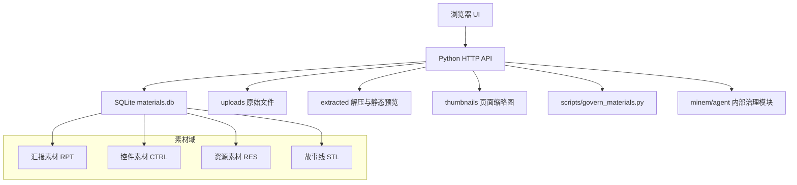
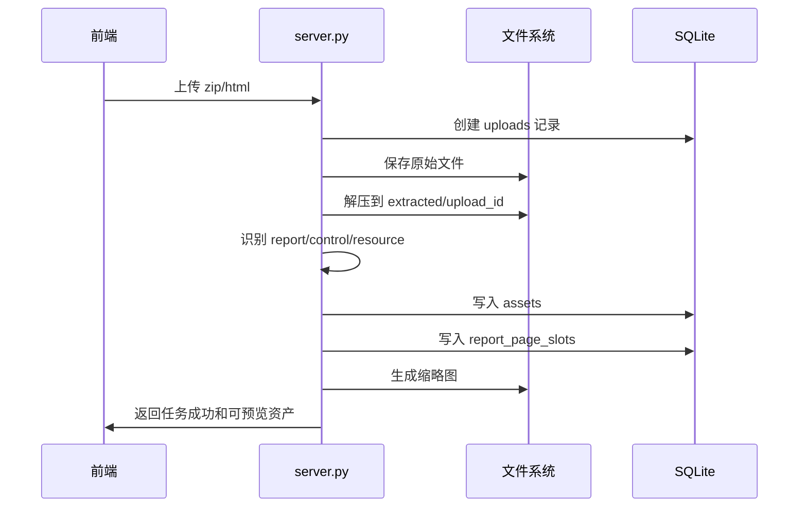

# MineM 技术文档

版本：0.4.0 · 2026-07-19

## 1. 技术栈

- 前端：React + TypeScript + Vite，生产构建产物输出到 `public/`
- 后端：Python `ThreadingHTTPServer`
- 数据库：SQLite
- 文件存储：本地 `uploads/`、`extracted/`、`thumbnails/`
- 容器化：Docker Compose
- macOS 客户端：Tauri 2 + 系统 WebView；创作助手使用独立静态前端与官方全局快捷键插件

### 标签迁移状态

- `assets.tags`、`asset_history.tags`、`report_storyline_collections.tags` 为已退役的平铺旧字段；P0 已清空，且服务端不再写入。
- 类型、媒体、资源分类、编号、来源、版本、页槽位和编排继续使用各自的结构化字段，不能用标签替代。
- 旧 `POST /api/assets/{id}/tags` 与 `POST /api/ai-tag` 在 P1 新词表上线前返回停用提示；核心数据测试持续验证旧标签没有回填。
- P1 AI 标签建议按“人工确认 > 页面自身内容 > 汇报上下文 > 演讲稿/妙记/外部文档 > 结构化来源 > 文件名路径”聚合证据；每条候选需保存 `dimension`、`tag`、`confidence`、`evidence`、`priority`、`conflict_status`，冲突或低置信度不写入正式标签。
- 标签分析使用独立任务队列，与导入和同步服务分离。任务字段至少包括：`scope`、`trigger_type(manual|scheduled|retry)`、`status`、`content_fingerprint`、`model_version`、`taxonomy_version`、`progress`、`error`、`created_at`、`updated_at`。幂等键为“素材版本/内容指纹 + 模型版本 + 词表版本”；定时调度只选择待分析、内容变化或可重试失败项。
- 当前执行器为 `evidence-v1`：仅提取页面 HTML 文本、标题/图片替代文本、页面元数据、汇报页槽上下文和结构化来源证据，并写入 `asset_tag_evidence`；候选标签数组固定为空，不写 `assets.tags`。服务内调度器在本地时区每日 `00:00` 发起 changed-assets 任务；`scripts/run_tag_analysis.py` 可供外部 cron/运维调度调用。

## 2. 系统架构



## 3. 目录结构

```text
minem/
  frontend/                     # React + TypeScript 源码
  minem/                        # Python 领域模块
    agent/                      # 可选自动化能力，默认不开放 HTTP
  desktop/                      # macOS 客户端源码
  scripts/                      # 测试、校验、治理、版本与 CLI
  docs/                         # 产品和工程文档
  templates/                    # 运行时 HTML 模板
  public/                       # Vite 生成产物，不提交
  data/                         # SQLite 与本地状态，不提交
  uploads/                      # 原始上传，不提交
  extracted/                    # 入库素材与派生产物，不提交
  thumbnails/                   # 可再生缩略图，不提交
  report-exports/               # 导出产物，不提交
  server.py
  Dockerfile
  docker-compose.yml
```

说明：`frontend/` 是管理平台源码；`public/` 由构建任务生成并由后端静态托管。运行数据与源码分离，公开仓库和 CI 均以空素材库启动。`minem/agent/` 不进入前端导航，其 HTTP API 默认关闭。

## 3.1 导入资源闭包

导入任务在解压或复制文件后、写入 `uploads` 和 `assets` 前执行 `minem/html_dependencies.py` 的只读递归审计。审计以 HTML 页面为入口，解析 `src`、`poster`、`data-fs-src`、`srcset`、样式表链接、内联 CSS `url()` 与 iframe；HTML/CSS 引用继续递归，直到本地依赖闭合。外部 URL、data URI、锚点和协议链接不纳入本地缺失判断。

审计不尝试以其他素材的同名文件替代缺失资源，避免错误内容被静默展示。发现缺失时任务在入库前失败，`extracted/{upload_id}/.minem-dependency-audit.json` 保留诊断；已存在历史包通过治理脚本检出并进入修复清单，不能再被误判为“预览正常”。

### 导入事务与重建

所有 HTTP 上传、异步任务和自动扫描必须共用同一个导入编排器，禁止上传接口绕过依赖校验后直接调用目录扫描。导入编排器的阶段为 `received -> extracted -> validated -> classified -> rendered -> published`；只有 `published` 才写入正式 `assets`、`report_page_slots`、资源关系和缩略图。

历史批次重建先输出引用清单和 dry-run，再在单一事务中更新数据库，并将旧批次派生目录移入任务级临时隔离区；成功后删除隔离区，失败则回滚事务并恢复目录。项目运行目录不创建 SQLite 副本。清理范围仅限 `upload_id` 对应的资产、候选页、页面槽、尺寸适配映射、缩略图和旧导入任务；重建读取原始 ZIP/HTML，生成新的批次 ID，避免旧 `_minem_pages`、`candidate-*`、`current-*`、`_minem_normalized` 再次参与源文件扫描。

HTTP 导入在依赖闭包通过后计算 `package-v1` 规范化指纹：按相对路径排序，并组合每个文件的字节内容。该指纹不受 ZIP 压缩参数和上传文件名影响。批次记录、素材、页槽和资源关系使用同一 SQLite 事务发布；页面完整性校验失败时整笔回滚。缩略图在事务提交后异步生成，不参与素材分类与正式数据提交。

`AUTO_IMPORT_ON_START` 默认值为 `0`；只有显式设置为 `1` 才允许启动扫描。普通 HTML 没有汇报 Manifest 或多页 Deck 结构时按页面素材处理。

## 3.2 macOS 创作助手

创作助手由 `desktop/ui/quick-actions.html`、`quick-actions.js` 和 `quick-actions-core.mjs` 组成。UI 只维护汇报/页面双模式、当前上下文和自定义指令；核心模块负责动作定义、编号与链接分类、必填校验和 `minem.codex-operation.v1` 操作包生成，可由 Node 内置测试独立验证。

Tauri 原生层使用 `tauri-plugin-global-shortcut` 注册 `Option + Command + M`，并记录客户端最近成功导航的 MineM URL。创作助手只暴露剪贴板读写、最近 URL 查询和窗口隐藏命令，不调用 MineM 写 API，也不读取数据库、素材目录或其他应用浏览历史。详细交互与安全边界以 `docs/macos-desktop-client.md` 为准。

## 4. 数据模型

### 4.1 assets

核心资产表。

关键字段：
- `id`：内部主键
- `asset_code`：外部引用 ID
- `asset_type`：`report` / `control` / `resource`
- `category`：`report` / `page` / `proof` / `workflow` / `story` / `visual` / `code`
- `media_kind`：`html` / `image` / `video` / `gif` / `svg` / `none`
- `resource_kind`：`image` / `logo` / `icon` / `gif` / `video` / `svg`
- `upload_id`：来源批次
- `source_path`：批次内相对路径
- `preview_url`：预览路径
- `source_hash`：内容或来源哈希
- `version_group` / `version_no` / `version_parent_id`：相似图片版本组

### 4.2 uploads

导入批次表。

字段：
- `id`
- `filename`
- `stored_path`
- `extract_path`
- `file_count`
- `asset_count`
- `created_at`

### 4.3 report_page_slots

汇报页面槽位表，支持并行页面生成。

字段：
- `report_id`
- `page_number`
- `title`
- `status`
- `control_id`
- `task_key`
- `note`

### 4.4 report_page_arrangements

汇报编排元数据表，不改写来源 HTML。

字段：
- `report_id`：汇报素材 ID，唯一
- `page_order`：按当前展示顺序排列的页面素材 ID 数组
- `hidden_page_ids`：当前隐藏的页面素材 ID 数组
- `updated_at`：最后一次人工编排时间
- `updated_by`：操作来源，当前为 `manual-arrangement`

规则：
- 页面拖拽、隐藏、恢复仅更新前端会话内的编排状态；关闭弹窗即丢弃，服务端不保存草稿。
- 用户点击“确认编排”后，前端调用更新接口一次性提交 `page_order`、`hidden_page_ids` 和 `removed_page_ids`；服务端在单个事务内重建当前汇报的页面槽位、更新编排元数据和汇报活动时间。
- 前端以当前会话编排与服务端已确认编排的序列和隐藏集合比较，计算 `dirty` 状态；`dirty` 时关闭操作弹出保存确认，不调用接口前不得关闭主弹窗。
- 关闭确认提供保存、放弃、继续编辑三个结果：保存复用确认编排提交；放弃清空本地会话状态并关闭；继续编辑不改变任何状态。
- 编排主界面为独立前端路由，至少携带 `reportId`；详情预览的“编排”入口只负责导航，不再承载编排会话。
- 前端初始化必须解析 `?arrange=<reportId>` 并读取目标汇报后恢复编排工作区；深链不得依赖先从详情弹窗点击产生的内存状态。
- 页面素材选择器调用分页素材接口并固定 `type=control`、`include_versions=0`，使用已有缩略图；搜索、筛选和翻页不触发缩略图重建。
- 插入操作在前端会话中生成待提交的页面项。确认后服务端为新页面创建 `report_page_slots` 引用，再原子写入 `report_page_arrangements`；重复选择同一页面时按一次插入处理。
- 移出操作只允许移除当前汇报已有的槽位引用；确认后不删除 `assets`、资源文件或其他汇报槽位，页面素材仍可被检索和重新插入。服务端拒绝将汇报移为空页。
- 页面槽位 `page_number` 在确认时按最终顺序重新编号；已有槽位的 `control_id` 和来源文件均不改写。
- 汇报详情、独立预览、播放和导出读取编排元数据后组合页面；无编排记录时保持来源解析顺序。
- 完整汇报导出使用已确认的 `report_page_slots` 与 `report_page_arrangements` 作为唯一输入，过滤 `hidden_page_ids` 和已移出槽位；导出服务不得读取前端未确认会话状态，也不得回写 `assets`、槽位、编排或来源 HTML。
- 编排表只引用既有 `report_page_slots.control_id`，不插入新的 `assets`、资源或来源 HTML 文件。
- 页面素材被重新同步后，读取时按现有页面槽位补齐新增页，并丢弃已不存在的引用。
- 独立页面公开入口为 `/pages/{controlId}/index.html`。直接访问来源 `/extracted/{uploadId}/{sourcePath}` 时，非嵌入请求重定向到该入口；嵌入请求携带 `embed=1`，继续返回来源 HTML 并注入统一等比适配样式，避免查看器嵌套。

### 4.5 report_export_tasks

完整汇报导出任务表与文件目录。导出是异步任务，不占用前端请求线程；任务状态为 `queued`、`running`、`completed`、`failed`，记录 `report_id`、格式、可见页数、进度、错误信息、输出路径、创建/更新时间。

- HTML 导出器调用 `report_public_page_items(report_id)` 获取已确认页面序列，以新建临时工作目录复制每页 HTML 与依赖资源，生成离线 Viewer 和 `minem-export-manifest.json`，最后写为 ZIP。
- HTML 导出器调用 `report_public_page_items(report_id)` 获取已确认页面序列，以新建工作目录递归收集每个页面 HTML、CSS、JS 中的本地依赖，生成离线 Viewer 和 `minem-export-manifest.json`，最后写为 ZIP。不得复制整个提取包；`ai-presenter`、TTS、语音模型、模型权重、语音文件和演讲稿路径均被硬性排除，即使被旧页面旁路引用也不进入成品。代码文件仅使用 ZIP 无损压缩，不进行语义改写；不设置导出文件体积上限。
- 二进制资源在 ZIP 中使用 `ZIP_STORED`：图片、视频、音频、GIF、SVG、字体、PDF 和未知二进制绝不重编码。页面资源仍使用其原始相对路径，缺失页面 HTML 必须导致任务失败。
- PDF 导出器以 Chromium 隔离上下文逐页加载平台嵌入预览壳，使用 10 秒虚拟时间等待字体、图片、视频首帧与动效定时器完成后截图，再合并为单个 PDF。任何页面截图失败或超时都会使任务失败，不生成不完整 PDF。
- 每页 PDF 输出使用汇报目标画布，最终合并为单个 PDF。导出临时目录、任务记录和成品放在运行数据目录 `report-exports/`，不提交 Git；不影响 `uploads/`、`extracted/`、`thumbnails/`。任务不回写素材、资源、页面槽或版本组。

### 4.6 asset_history

控件历史版本表。

触发场景：
- 同一页控件重新同步
- 单页导入覆盖已有控件

历史预览使用 `_history` 快照路径，避免当前版本覆盖历史版本。

### 4.7 report_storyline_collections

汇报收藏为故事线的持久化表。

字段：
- `id` / `code`：故事线内部 ID 与外部引用 ID，外部 ID 形如 `STL-YYYYMMDD-NNN`
- `source_report_id` / `source_report_code`：被收藏的来源汇报
- `output_report_id` / `output_report_code`：历史兼容字段；新收藏不再生成汇报资产，默认留空
- `target_report_id`：历史兼容字段；新收藏不再创建汇报版本，默认留空
- `mode`：新收藏写入 `collection`；历史数据可能存在 `new` 或 `version`
- `note` / `tags`
- `version_group` / `version_no` / `version_parent_id`：故事线自身版本组、版本号和父版本记录
- `created_at` / `updated_at`

收藏规则：
- 新增故事线只写入 `report_storyline_collections`，不插入 `assets`。
- 新建故事线时 `version_group = id`，`version_no = 1`。
- 更新已有故事线版本时，沿用目标故事线的 `version_group`，新增 `version_no + 1` 的记录，`version_parent_id` 指向被更新的故事线版本。
- 列表接口默认返回每个 `version_group` 的最新版本，并在 `versions` 中返回该故事线的完整版本历史。
- 不新增 `report` 资产，不创建汇报资产版本，不改变汇报列表数量。
- 来源汇报通过 `source_report_id` 关联；故事线详情可跳转查看来源汇报。
- 收藏动作不改写原始 HTML，也不改变生成素材的方式。

## 5. 编号规则

- 汇报素材：`RPT-YYYYMMDD-NNN`
- 来源汇报控件：`CTRL-{来源短码}-YYYYMMDD-页码`
- 无来源控件：`CTRL-PAGE-NNN`
- 无汇报 Manifest 的多页面资源导入：每个 HTML 入口按 `CTRL-PAGE-NNN` 独立入库，`source_type=control-resource-import`；不得创建推断型 `RPT` 资产。
- 案例多页面组使用 `CASE-*` 作为管理编号，案例组不是 `assets.report`，其内部页面仍为 `CTRL-*`。
- 图片资源：`RES-IMG-YYYYMMDD-NNN`
- 视频资源：`RES-VID-YYYYMMDD-NNN`
- GIF 资源：`RES-GIF-YYYYMMDD-NNN`
- SVG 资源：`RES-SVG-YYYYMMDD-NNN`

历史 `CTRL-MOCK-*` 会由治理脚本迁移为来源汇报编号。

## 6. API

| Method | Path | 说明 |
| --- | --- | --- |
| GET | `/api/assets` | 获取素材列表，支持 `type/category/resource_kind/control_role/q/include_versions/page/page_size` |
| GET | `/api/assets/{id}` | 获取素材详情 |
| GET | `/reports/{id}/index.html` | 汇报真实公开入口，按已确认的页面编排组合展示 |
| GET | `/api/reports/{id}/arrangement` | 获取汇报页面、缩略图和当前排序/隐藏状态 |
| POST | `/api/reports/{id}/arrangement` | 用户确认后提交汇报页面排序和隐藏状态，并更新真实公开入口 |
| DELETE | `/api/assets/{id}` | 删除素材 |
| GET | `/api/assets/{id}/export` | 导出控件模板包 |
| POST | `/api/reports/{id}/exports` | 创建完整汇报 HTML/PDF 导出任务，参数 `format: html|pdf` |
| GET | `/api/report-exports/{taskId}` | 查询导出任务状态、进度、失败页面与下载地址 |
| GET | `/api/report-exports/{taskId}/download` | 下载成功的导出文件 |
| GET | `/api/assets/{id}/history` | 获取控件历史 |
| GET | `/api/assets/{id}/versions` | 获取相似版本 |
| GET | `/api/assets/{id}/lineage` | 获取原数据链路详情，供双抽屉列表和详情使用 |
| POST | `/api/assets/{id}/tags` | 旧标签接口，P0 停用，待维度化词表上线后替换 |
| POST | `/api/uploads` | 同步导入 zip |
| POST | `/api/import-tasks` | 创建异步导入任务，支持 HTML、ZIP、图片、SVG、GIF 和视频 |
| GET | `/api/import-tasks` | 获取最近导入任务 |
| GET | `/api/import-tasks/{id}` | 查询导入任务 |
| POST | `/api/auto-import` | 自动扫描本机素材 |
| POST | `/api/sync-report-materials` | 显式同步 extracted 中的汇报材料包 |
| POST | `/api/ai-tag` | 旧自动打标接口，P0 停用，待 AI 候选标签能力上线后替换 |
| POST | `/api/merge-similar` | 合并相似图片 |
| GET | `/api/storylines` | 获取故事线模板与汇报收藏产生的故事线；收藏故事线按最新版本返回并包含版本历史 |
| GET | `/api/case-groups` | 从已导入案例 manifest 与真实 `CTRL-*` 主版本生成案例组；过滤未入库或无预览页面 |
| GET | `/api/reports/{id}/pages` | 获取汇报页槽 |
| POST | `/api/reports/{id}/pages` | 创建或更新汇报页槽 |
| POST | `/api/reports/{id}/controls` | 将汇报页面导入为控件 |
| POST | `/api/reports/{id}/storyline-collections` | 将汇报新建为故事线或作为已有故事线的新版本 |
| GET | `/api/reports/{id}/trusted-entry` | 校验完整汇报入口文件 |
| POST | `/api/report-page-candidates/{id}/adopt` | 采纳候选页面并同步到最新汇报 |

### 6.1 原数据链路接口

`GET /api/assets/{id}/lineage` 返回当前素材、来源批次、可信入口和可点击 section。

`GET /api/assets` 在数据库分页前计算 `activity_at` 并倒序排列。该值取素材自身更新时间、版本组最近更新时间；页面素材还合并 `report_page_slots` 与 `report_page_candidates` 的最近引用时间。前端只用 `activity_at` 做同页稳定排序，不重新改变跨页顺序。

核心结构：
- `asset`：当前素材摘要。
- `sourceBatch`：当前素材 `upload_id` 对应批次摘要。
- `trustedEntry`：完整汇报的入口校验结果，仅汇报素材一定存在。
- `sections`：前端原数据链路的可点击字段列表。

当前 section：
- `current-stage`：当前层级。
- `source-action`：生成动作。
- `source-batch`：原数据批次。
- `batch-output`：批次产物，按 report/page/control/resource 分组。
- `created-at`：入库时间。
- `resource-breakdown`：资源细分，按 `resource_kind` 分组。
- `source-path`：原始路径。

数据口径：
- 汇报数：同一 `upload_id` 下 `asset_type=report` 的资产数。
- 页面数：优先取完整汇报可信入口解析到的页面数，不等同于已拆出的控件数。
- 控件数：同一 `upload_id` 下 `asset_type=control` 的资产数。
- 资源数：同一 `upload_id` 下 `asset_type=resource` 的资产数。
- 资源细分：同一 `upload_id` 下资源资产按 `resource_kind` 聚合。

### 6.2 素材列表分页

`GET /api/assets` 在传入 `page` 或 `page_size` 时启用服务端分页；不传分页参数时保持旧行为，返回完整列表，兼容旧调用方。

请求参数：
- `page`：页码，从 1 开始。
- `page_size` / `limit`：每页数量，最大 200。
- `control_role`：控件素材的叙事角色筛选，取值如 `开场定位`、`背景价值`、`案例展开`，默认 `全部`。

返回结构：
- `assets`：当前页素材。
- `pagination.page`：当前页。
- `pagination.pageSize`：实际每页数量。
- `pagination.total`：符合筛选条件的总数。
- `pagination.totalPages`：总页数。
- `pagination.hasPrev` / `pagination.hasNext`：上一页/下一页状态。

前端当前主素材库使用 `page_size=30`，采用滚动加载下一批；工作台每类只拉取前 8 条作为概览样本。素材查询统一按最近业务活动时间倒序返回：汇报取编辑/更新，页面取编辑、版本或引用更新，资源取新增、编辑、复用或版本更新。该顺序由 `ASSET_ACTIVITY_SQL` 统一计算，API 和前端不得再次按标题或创建时间覆盖排序。

### 6.3 外部资源导入

`POST /api/import-tasks` 支持资源素材页的“导入外部资源”入口。

支持格式：
- 汇报/素材包：`.html`、`.htm`、`.zip`
- 图片与矢量：`.png`、`.jpg`、`.jpeg`、`.webp`、`.svg`
- 动态与视频：`.gif`、`.mp4`、`.mov`、`.m4v`、`.webm`

处理口径：
- HTML 复制为该批次的 `index.html`，再由 `scan_upload()` 识别为汇报素材。
- ZIP 安全解压到 `extracted/import-*`，再扫描其中的汇报、控件和资源。
- 单个资源文件复制到 `extracted/import-*`，再扫描为资源素材。
- 该流程只做平台入库解析，不改变已有生成素材目录和生成方式。

## 7. 导入流程



## 8. 预览一致性

实现点：
- `row_to_asset()` 调用 `canonical_preview_url()`。

### 8.1 Preview Shell

- 新增前端统一预览壳组件，输入为页面 URL 列表、当前索引、页面标题和是否允许翻页；汇报、临时汇报、案例、编排后预览与独立预览均复用该组件。
- 预览壳使用 iframe 懒加载当前页及相邻页，其他页面不创建 iframe；不维护用户缩放状态，不写入资产或来源 HTML。
- 汇报和页面平台查看器的外层预览容器固定为 `1920×1080` 逻辑画布，使用 `contain` 计算 iframe 显示区域；来源素材的 `preview_meta.width/height` 只用于裸来源 HTML、资源预览和尺寸版本生成，不能再次缩放统一查看器。`ResizeObserver` 驱动尺寸重算，避免轮询和重复加载。
- 对固定尺寸来源 HTML，Preview Shell 必须以检测到的来源逻辑画布宽高创建内层 viewport，并对该 viewport 应用单一 `transform: scale()`；不得只放大 iframe 外框，否则会产生左上角内容和大面积空白。来源比例为 16:9 时缩放后应填满标准容器。
- 无法可靠检测逻辑画布时，预览壳以 iframe 文档根节点的 `scrollWidth/scrollHeight` 与 `getBoundingClientRect()` 进行一次性握手测量；测量失败回退 16:9，并记录预览诊断结果供数据走查。
- 汇报页槽写入前执行 `report_canvas_normalize`：读取当前汇报的目标逻辑画布（默认 `1920×1080`，或来源汇报已声明的尺寸）与页面素材的逻辑画布。两者不一致时，生成新的 `control` 资产版本和派生 HTML，而不是在查看器中强行拉伸；新版本沿用原 `version_group`，设置原素材为 `version_parent_id`，记录 `target_report_id`、`target_canvas_width`、`target_canvas_height`、`normalization_source_id` 和生成指纹。
- 同一来源版本、同一目标画布、同一派生策略的适配结果必须幂等复用，避免重复导入或重复编排生成多个等价版本。汇报槽只引用适配后的版本；原页面素材、其资源、历史链接和其他汇报的引用不得被改写或删除。
- 页码胶囊、全屏、复制当前页链接、刷新均为外层控件。Preview Shell 固定输出 `.fullscreen-page` 图标按钮，使用 Fullscreen API 对 `document.documentElement` 进入或退出全屏，并在 `fullscreenchange` 时同步按钮的标题和 `aria-label`；不得提供平台放大/缩小、滚轮缩放或画布拖拽；刷新只重载当前 iframe，复制使用当前页的真实预览 URL。
- 键盘事件仅在预览壳获得焦点时响应，避免干扰素材库搜索与弹窗输入框。
- 嵌入预览统一携带 `embed=1` 标记。服务端不得向带该标记的来源页注入复制/刷新工具；Preview Shell 是唯一的工具栏渲染者。
- 故事线来源汇报同样读取统一编排查看器并携带 `embed=1`，避免故事线弹窗内出现第二套页面工具。
- `report_canvas.py` 生成的尺寸包装页以包装文件为基准计算源页面相对 URL。该 URL 必须同时支持 HTTP `/extracted/...` 托管和 Chromium `file://` 缩略图截图；启动归一化会修复当前页槽及历史 `report_page_normalizations` 记录中的旧绝对地址，并为改写文件重新排队生成缩略图。
- 对可识别的来源内置导航，嵌入层在不改写源文件的前提下添加隔离样式，隐藏常见的页码、上一页/下一页、轮播和全屏控制节点；多页来源由解析结果拆成平台页面序列，统一由 Preview Shell 切换 iframe URL。
- “打开链接”由资产预览路由处理，返回 Preview Shell；原始 `/extracted/...` 地址只作为嵌入和原始文件访问地址，不在平台操作中直接作为用户预览入口。
- 如果 `upload_id/source_path` 对应文件存在，API 返回真实路径。
- 如果历史版本 `preview_url` 指向 `/extracted/_history/`，保持历史快照。
- 治理脚本的 `normalize_preview_urls()` 会修复 DB 中错位的 preview。

前端使用：
- 卡片：`thumbnail_url` 优先，缺失时才惰性加载 `preview_url`；案例组 API 返回首个真实页面的 `thumbnailUrl`，列表不得用多页汇报 iframe 作为常规预览。
- 详情：直接使用 `preview_url`
- 打开链接：直接使用同一条资产的 `preview_url`

## 9. Logo 治理

治理逻辑：
1. 从来源路径和标题中识别企业名。
2. 对 PPT 图片编号建立映射，如 `s6-logo-136.png -> 长鑫存储（CXMT）`。
3. 对 `nio/jifeng/hailiang/pengfei/feishu` 等关键词直接命名。
4. 无法可靠识别时生成稳定中文标题，例如 `先进制造企业标识 140`。
5. 自动补充 `企业logo/客户logo/品牌标识/可直接使用` 等标签。

## 10. React 前端弹窗与抽屉

详情弹窗由 `frontend/src/App.tsx` 中的 React 组件渲染。当前稳定能力：
- 顶部操作区固定高频操作：打开预览、复制链接、复制 ID、删除。
- 相似版本区和并行页面生成区仍保持隐藏，避免干扰主素材管理流程。
- 原数据链路点击后调用 `/api/assets/{id}/lineage`。
- 双抽屉在详情弹窗内展开：左侧展示关联数据列表，右侧展示选中项详情和预览。
- 标签编辑、资源筛选、分页和导入任务浮窗均使用 React state 管理。导入任务关闭状态以设备级 `localStorage` 保存任务 ID 与关闭时间水位线；不写入共享服务端，避免一个用户关闭任务影响其他组织成员。

注意：
- API 请求统一走 `frontend/src/api.ts`，不要在组件中散落 `fetch()`。
- URL 字段需通过 `absoluteUrl()` 或后端 canonical preview 口径收敛，后续应增加 URL 白名单校验。
- 前端文案默认由 React 转义；如未来引入 `dangerouslySetInnerHTML`，必须单独做白名单和净化。
- 继续拆分时优先把 `AssetModal`、`LineageDrawer` 拆成独立组件文件；`ImportDialog` 已迁入 `components/ImportWidgets.tsx`。

## 11. 数据治理脚本

命令：

```bash
python3 scripts/govern_materials.py
```

治理范围：
- 时间戳秒转毫秒
- 汇报标题去重
- report/control 分类归一
- 旧控件编号迁移
- Logo 标题清洗
- 预览路径校验
- 控件版本修复
- 孤儿关系删除
- 历史表 asset_code 同步
- 上传批次数量重算

## 12. Docker

启动：

```bash
docker compose up -d --build
```

访问：

```text
http://127.0.0.1:8790/
```

Docker 镜像使用 Node 构建阶段从 `frontend/` 生成生产前端，最终 Python 镜像不复制本机 `public/`。SQLite journal mode 由 `SQLITE_JOURNAL_MODE` 控制；数据、上传、解析、缩略图和导出目录通过 volume 持久化，容器重建不会丢失数据。

公开版 Compose 默认不挂载外部素材源，并设置 `AUTO_IMPORT_ON_START=0`。用户需要自动扫描时，必须复制 `docker-compose.override.example.yml` 并显式配置只读来源。平台与可选 TTS 服务仅绑定 `127.0.0.1`；TTS 使用独立 `speech` profile，模型权重不随仓库分发。内部 Agent API 默认关闭，需要时必须显式设置开关和随机令牌。

`uploads.stored_path` 与 `uploads.extract_path` 对平台自有文件使用运行目录相对路径，外部来源才保留外部绝对路径。上传包使用 `content_hash` 做幂等判断；相同内容再次上传时复用已有批次和预览。

上传安全配置：
- `MAX_UPLOAD_BYTES`：单个上传文件最大字节数，当前 compose 为 512MB。
- `MAX_UPLOAD_REQUEST_BYTES`：HTTP 请求体最大字节数，默认比单文件多 16MB 用于 multipart 开销。
- `MAX_ZIP_FILES`：压缩包最大文件数，当前 compose 为 5000。
- `MAX_ZIP_MEMBER_BYTES`：压缩包内单文件最大字节数，默认 256MB。
- `MAX_ZIP_TOTAL_BYTES`：压缩包解压后总量，当前 compose 为 1GB。
- `MAX_ZIP_COMPRESSION_RATIO`：压缩比异常阈值，默认 120。

## 12.1 公开运行边界

- 本机一键启动器负责创建 `.venv`、安装锁定依赖、构建前端并启动仅监听本机的服务。
- Docker 构建从源码生成前端，不依赖或复制开发机生成的 `public/`。
- CI 使用临时 `MINEM_DATA_DIR` 验证空素材库 API，不读取开发机数据库。
- GitHub 发布只使用 `public-release.json` 定义的源码边界，并对导出目录执行严格检查。
- 运行数据、外部导入源、模型、安装包和内部 Git 历史均不进入公开源码快照。

## 12.2 历史架构审查记录

截至 2026-07-18，代码规模：
- `server.py`：6,419 行；图谱 API 与领域模块已删除，仍集中 HTTP 路由、治理和部分汇报编排逻辑，是下一轮后端拆分重点。
- `minem/`：领域模块承接数据库、导入、HTML 拆页、汇报写库、案例真实清单、资源、标签、版本、资产分页、链路、缩略图和上传安全；新增 `case_groups.py` 后，案例不再依赖前端静态数据。
- `frontend/src/App.tsx`：2,146 行；主界面已删除无业务内容的设置页，案例、工作台和导入任务 UI 已拆至 `components/`，其余列表、详情和编排继续分批拆分。
- `frontend/src/components/`：当前包含 `CaseControlLibrary.tsx`、`Workbench.tsx`、`ImportWidgets.tsx`。
- `frontend/src/api.ts`：统一 API 请求和预览 URL 处理。
- `frontend/src/styles.css`：2,658 行，仍需按组件域拆分。

第一阶段已完成：
- 新增 `minem/config.py`，集中管理上传和解压安全配置。
- 新增 `minem/upload_safety.py`，统一限制上传文件大小、zip 文件数量、单文件大小、解压后总量、压缩比、路径穿越和符号链接。
- 新增 `minem/import_tasks.py`，将导入任务从进程内存迁移到 SQLite `import_tasks` 表。
- `GET /api/assets` 和 `GET /api/stats` 不再触发同步写入；同步改为显式 `POST /api/sync-report-materials`。

第二阶段已完成：
- `/api/assets` 支持服务端分页和控件角色服务端筛选。
- 前端素材库按页加载，筛选、搜索、切换类型时回到第一页。
- 工作台汇报、控件、资源概览只取每类前 8 条，避免进入工作台时全量拉取。
- 新增 `scripts/check_api_contract.py`，检查核心 API、分页结构、导入任务结构、链路接口和读接口无写入副作用。

第三阶段已完成：
- 新增 `minem/assets.py`，承接素材列表查询、筛选、分页和响应结构组装。
- 新增 `minem/lineage.py`，承接批次摘要、sourceBatch 注入、原数据链路详情和 pipeline summary。
- 新增 `minem/reports.py`，承接页码解析、候选页注册、页槽挂载和页槽读取。
- `server.py` 保留兼容包装函数和 HTTP 路由，领域逻辑继续从主服务文件迁出。
- `server.py` 从约 4749 行降至约 4421 行，第一批领域拆分减少了主文件职责密度。

第四阶段已完成：
- 新增 `minem/thumbnails.py`，承接 HTML 预览缩略图生成、比例裁剪、低方差兜底、文本缩略图和批次缩略图生成逻辑。
- `server.py` 对缩略图只保留依赖注入包装，缩略图模块可独立编译和后续测试。

第五阶段已完成：
- 新增 `minem/db.py`，承接 SQLite 连接、目录初始化、核心建表、资产表轻量迁移、索引创建和兼容迁移。
- `server.py` 的 `db()`、`ensure_schema()`、`init_db()` 改为薄包装，业务回填函数通过参数注入到数据库初始化流程。
- `SQLITE_JOURNAL_MODE` 在数据库模块中做白名单归一，避免环境变量直接拼接成不受控 PRAGMA。
- `server.py` 从 4397 行降至 4271 行，建表脚本不再内联在主服务文件里。

第六阶段第一轮已完成：
- 新增 `minem/imports.py`，承接导入任务存取包装、导入源配置读取、候选文件遍历、异步导入任务执行、自动扫描导入、直接文件导入和 zip 导入编排。
- `server.py` 保留原函数名作为兼容入口，通过依赖注入调用导入模块，HTTP 路由和后台线程调用方式不变。
- 自动导入模块测试使用临时目录和临时 SQLite 验证，不写入真实素材库。
- `server.py` 从 4271 行降至 4159 行，导入扫描编排已从主服务迁出。

第六阶段第二轮已完成：
- 新增 `minem/html_splitter.py`，承接 HTML 页节点识别、控件页抽取、汇报页替换、viewer pages 同步、页数检测和控件 HTML 构建。
- 新增 `minem/report_package_importer.py`，承接汇报包 manifest 识别、汇报入口定位、页面清单解析、候选页副本路径和汇报包目录发现。
- `server.py` 保留同名兼容包装，通过依赖注入复用 `read_json_file`、`merge_tags`、`slugify` 等本地规则。
- `server.py` 从 4159 行降至 3890 行，汇报包识别和 HTML 拆页基础逻辑已从主服务迁出。

第六阶段第三轮已完成：
- 新增 `minem/resource_importer.py`，承接素材包内 `assets/` 资源入库、资源类型识别后的标签合并、Logo 命名治理和资源 upsert。
- 新增 `minem/report_package_writer.py`，承接完整 report package 同步写库，包括汇报素材 upsert、控件候选版本写入、页槽挂载、缩略图触发、资源同步和上传批次计数更新。
- `server.py` 保留 `sync_report_package_resources()`、`sync_report_material_package()` 作为兼容包装，通过依赖注入复用现有编号、版本、页槽和缩略图规则。
- 临时 SQLite + 临时素材包模块测试验证可同步出 report/control/resource 各 1 条，不写入真实素材库。
- `server.py` 从 3890 行降至 3694 行，导入流水线写库逻辑已从主服务迁出。

第六阶段第四轮已完成：
- 新增 `minem/tagging.py`，承接标签拆分/合并、标签角色清洗、自动标签推断、资源类型判断、Logo 企业名识别和稳定中文命名。
- 新增 `minem/similarity.py`，承接图片 dHash、SVG 归一化哈希、相似资源特征采集、版本组计算和版本组写库。
- `server.py` 保留原函数名作为兼容包装，统一注入 `TAG_RULES`、资源标签白名单、Logo 企业映射、PIL 图片对象和素材路径解析函数。
- `server.py` 从 3694 行降至 3270 行，标签治理和相似版本计算已从主服务迁出。

第七阶段已完成：
- 新增 React + TypeScript + Vite 工程，源码位于 `frontend/`，构建产物输出到 `public/` 供 Python 后端托管。
- 新增 `frontend/src/api.ts`，统一 API 请求、错误处理和预览链接绝对化。
- 新增 `frontend/src/types.ts`，沉淀素材、分页、链路、导入任务等前后端契约类型。
- 新增 `frontend/src/App.tsx`，承接 App Shell、工作台、素材列表、详情弹窗、双抽屉、故事线和导入任务浮窗。
- 新增 `frontend/src/styles.css`，将外部设计规范落为 MineM 语义 token、顶部导航、卡片、弹窗和抽屉样式。
- `public/` 不再作为手写源码目录，只保存 Vite 生产构建产物。

整体重构阶段：
- 阶段 1：上传与导入安全、导入任务持久化、读接口去副作用。
- 阶段 2：素材列表服务端分页、工作台轻量加载、API 契约脚本。
- 阶段 3：抽离资产列表、原数据链路、汇报页槽领域模块。
- 阶段 4：抽离缩略图生成模块。
- 阶段 5：抽离数据库连接、建表、迁移和初始化基础设施。
- 阶段 6：抽离后端领域逻辑，包括扫描、zip/html 解析、汇报包识别、控件拆页、资源抽取、标签治理和相似版本计算。当前已完成导入流水线写库、标签治理和相似版本计算迁移。
- 阶段 7：前端 React 化和设计规范落地，统一 API、类型、状态、弹窗、双抽屉和导入任务视图。当前已完成 React 生产构建并由后端托管。
- 阶段 8：质量体系，补充导入/链路一致性测试，接入 Docker healthcheck 或发布前检查。

剩余风险：
- 前端已经建立独立组件目录，但资产列表、详情、故事线和编排仍集中在 `App.tsx`，后续继续按业务边界迁移。
- 后端仍有治理、HTTP 路由和部分兼容旧函数集中在 `server.py`，需要继续拆分。
- API 契约脚本已覆盖核心读接口，但还没有纳入 CI 或 Docker healthcheck。

建议拆分：
- 后端：继续拆为 `governance.py`、`http_handlers.py`，并逐步清理 `server.py` 中的兼容包装函数。
- 前端：继续拆为 `components/AssetGrid.tsx`、`components/AssetModal.tsx`、`components/LineageDrawer.tsx`、`components/ImportDialog.tsx`。
- 样式：按组件拆为 `tokens.css`、`layout.css`、`assets.css`、`modal.css`、`lineage.css`，继续由 `frontend/src/styles.css` 统一入口导入。

下一阶段整改优先级：
- P0：为显式同步和导入任务增加失败重试/取消。
- P1：原数据链路与详情预览的数据一致性测试；把契约脚本纳入发布检查。
- P2：继续拆 `governance.py` 和 `http_handlers.py`；统一弹窗/抽屉组件；URL 安全白名单。

## 13. 验证清单

每次发布前执行：

```bash
python3 -m compileall -q minem scripts server.py
npm run check
python3 scripts/check_repository_docs.py
python3 scripts/check_public_boundary.py
python3 scripts/version_control.py check
python3 scripts/test_html_dependencies.py
python3 scripts/test_import_pipeline.py
python3 scripts/test_report_canvas_normalization.py
docker compose build
docker compose up -d
python3 scripts/check_api_contract.py --base-url http://127.0.0.1:8790
curl -s http://127.0.0.1:8790/api/stats
```

浏览器验证：
- 首页无乱码图标
- MineM 品牌标识显示为 M
- 汇报卡片预览正常
- 控件卡片预览正常
- 资源 Logo 标题不显示导入中间文件名
- 详情弹窗内容与卡片预览对应同一资产
- 详情顶部可复制真实预览链接
- 原数据链路字段点击后出现双抽屉，左侧列表和右侧详情可联动
- `/api/narratives` 不作为正式 API 保留
