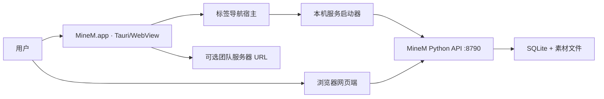
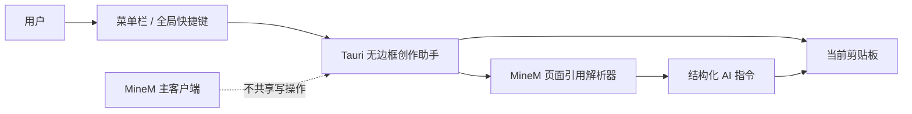

# MineM macOS 客户端技术设计

> 状态：已确认并实施。包含“页面链接复制”“页面刷新”和“MineM 创作助手”技术设计。
>
> 本文记录当前已实施基线。下一版本的一体化运行时、首次初始化、CLI/MCP/API 与资源包方案见 [MineM 本地 AI 客户端技术设计](MineM_LOCAL_AI_CLIENT_TECHNICAL.md)。

## 目标

在不改变现有网页端和素材生成链路的前提下，提供可安装的 macOS 客户端。用户可以继续用浏览器访问 MineM，也可以双击客户端打开同一套平台。

## 使用方式

| 场景 | 入口 | 服务位置 | 数据位置 |
| --- | --- | --- | --- |
| 网页端 | 浏览器访问平台 URL | 本机或团队服务器 | 服务端工作目录 |
| 本机客户端 | `MineM.app` | 客户端自动启动本机服务 | `~/Library/Application Support/MineM/` |
| 团队客户端 | `MineM.app` 连接团队 URL | 团队服务器 | 团队服务器 |

客户端默认使用本机模式；首次启动服务成功后，系统 WebView 打开 `http://127.0.0.1:8790/`。客户端不再要求用户手动启动 Docker、Python 或浏览器。

## 架构



- 前端：继续复用 React 构建产物，不复制页面和交互代码。
- 客户端壳：Tauri 2，使用 macOS 系统 WebView，降低 Electron 的体积与内存占用。
- 本机服务：启动打包后的 `minem-server`，监听 `127.0.0.1` 随机可用端口或默认端口；健康检查通过后再加载界面。
- 数据隔离：客户端通过 `MINEM_DATA_DIR` 指向用户目录，不能写入 `.app` 安装包，也不与 Docker 的工作目录共享 SQLite。
- 网页端兼容：网页端仍通过 API 访问，所有导入、素材、故事线和预览能力保持原有调用方式。

## 启动与恢复

1. 客户端读取本地设置，判断使用本机模式或团队服务器模式。
2. 本机模式先检查保存的服务地址是否健康；健康则复用现有实例。
3. 没有可用服务时，客户端启动 `minem-server`，并传入专属数据目录、仅本机监听和关闭自动扫描。
4. 客户端轮询 `/api/stats`，成功后导航到服务首页。
5. 客户端退出时只退出 WebView；本机服务由客户端子进程负责回收。异常退出后的孤儿服务由下一次启动健康检查和端口检查处理。

## 导航宿主

### 链接拦截与路由

1. 客户端创建固定主页标签，并用一个独立 WebView 承载每个内容标签。
2. `on_navigation`、新窗口请求和 `window.open` 都统一进入原生路由层。
3. 与当前本机服务基址相同的 URL，或与用户显式配置的团队服务域名相同的 URL，在客户端新标签中打开。
4. 其他 `https` URL 调用 macOS `open` 交给默认浏览器；`file:`、自定义协议和危险跳转一律拒绝并记录日志。
5. 标签状态包含标题、URL、加载中与关闭能力；本期不提供后退、前进、刷新或可编辑地址栏。

为避免 macOS WebKit 对 `target="_blank"` 与 `window.open` 的事件回调差异，客户端在每个 MineM WebView 注入轻量链接桥接脚本：将新开页请求转为同源的临时导航地址，原生 `on_navigation` 拦截该地址、创建标签并取消当前页导航。该桥接不修改 React 页面代码，不影响网页端行为。

### 页面链接复制

- React 复用统一的 `copyCurrentPageLink` 操作，优先使用 `navigator.clipboard.writeText(window.location.href)`。
- 浏览器权限或 WebView 剪贴板不可用时，使用隐藏文本域与 `document.execCommand("copy")` 作为回退。
- 仅在素材详情、预览和其他可独立打开的页面头部右上角渲染图标按钮；按钮使用现有图标库并提供无障碍标签与悬浮提示。
- 复制操作不请求后端、不触发素材更新，也不影响预览加载。

### 页面刷新

- 在同一页面操作区提供刷新图标，使用 `window.location.reload()` 重新加载当前 URL。
- 刷新前端详情页时重新请求详情和预览数据；刷新独立预览页时重新请求 HTML 与其资源，从而读取替换后的生成结果。
- 刷新仅重新读取内容，不调用导入、生成、去重或数据写入接口。

### 窗口模型

- 简化标签栏由 Tauri 原生窗口承载，网页端只负责 MineM 业务界面，避免修改现有 React 路由和页面布局。
- 多标签页复用同一应用窗口，不为每次“打开链接”创建独立 macOS 窗口。
- 关闭内容标签仅销毁对应 WebView；主页标签始终可回到素材库。

## MineM 创作助手

### 架构边界



- 在 Tauri 原生层使用独立 `WebviewWindow`，标签为 `quick-actions`；窗口默认 `alwaysOnTop`、`decorations: false`，隐藏而非销毁，失焦自动隐藏。
- 助手 UI 使用独立静态前端入口和纯 JavaScript 核心模块，不加载主素材库 React 应用，不请求列表、缩略图或导入任务接口，因此不增加平台首屏网络请求。
- 原生层通过官方 `tauri-plugin-global-shortcut` 注册 `Option + Command + M`，菜单栏入口作为快捷键冲突时的回退。客户端内的模式与复制快捷键只在助手获得焦点时生效。
- 原生层记录客户端最近一次成功导航的 MineM URL，用户点击“当前”时返回该 URL；不会监听其他应用或浏览器历史。
- 助手只调用受限 Tauri command：读取当前剪贴板文本、写入剪贴板、获取最近 MineM URL、获取本机服务基址、隐藏窗口。不得调用 MineM 写 API、通用文件读取 API或数据库。

### 指令模型与校验

```ts
type CreatorMode = "report" | "page";

type QuickAction =
  | "import_report"
  | "create_report"
  | "insert_page"
  | "replace_page"
  | "modify_report_page"
  | "extract_case"
  | "import_page"
  | "create_page"
  | "duplicate_page"
  | "modify_page"
  | "custom_prompt";

type PageReference = { code: string; url: string; title?: string };

type QuickActionPayload = {
  schema: "minem.codex-operation.v1";
  mode: CreatorMode;
  action: QuickAction;
  reportRef?: string;
  targetPage?: number;
  pageRefs: PageReference[];
  sourceRef?: string;
  requirements?: string;
};
```

- 解析器区分页面、汇报和普通来源：页面只接受 `/pages/{controlId}/index.html` 与 `CTRL-PAGE-*`；汇报接受 `/reports/{reportId}/index.html` 与 `RPT-*`；通用 `/extracted/...` 仅作为来源，不猜测素材类型。
- UI 状态机只允许 `report` 与 `page` 两个模式。资源检索、标签、合并和治理不进入该状态机。
- `insert_page` 和 `replace_page` 需要 `reportRef`、`targetPage` 和至少一个 `pageRef`；`duplicate_page` 与 `modify_page` 需要至少一个 `pageRef`。
- 操作包由 `quick-actions-core.mjs` 的纯函数生成；复制前重新校验，固定携带页面单页、多页归类、版本不覆盖、16:9 预览和结果回传约束。
- 自定义模板以 `localStorage` 保存于 `quick-actions` WebView 域，键名为 `minem.creator-assistant.templates.v2`；单条正文最大 8,000 字符、最多 30 条。模板只做受控变量替换，不执行 JavaScript、HTML 或网络请求。
- 后续如需“在浮窗直接执行”，必须另开需求，增加预览、确认弹窗、幂等请求键和 MineM API 权限范围；不复用本期复制功能直接写库。

### 构建与测试

- 浮窗前端与主客户端壳一同纳入 `npm run desktop:build`，但不影响网页端构建产物和 Python 服务侧车。
- 自动测试覆盖：双模式动作集合、页面/汇报/普通来源分类、必填上下文校验、操作包业务约束和结构化字段。
- 手工 macOS 测试覆盖：多显示器、全屏主窗口、剪贴板权限拒绝、快捷键冲突、外部 AI 应用粘贴结果。

## 构建与发布同步

### 何时必须重打包

| 变更范围 | 是否重打包 | 原因 |
| --- | --- | --- |
| `frontend/`、`public/` | 是 | 客户端内嵌前端构建产物 |
| `server.py`、`minem/`、`templates/` | 是 | 需重新生成 PyInstaller 本机服务侧车 |
| `desktop/` | 是 | 原生壳、签名或安装逻辑变化 |
| 用户数据、SQLite、上传素材 | 否 | 数据位于 Application Support，不属于程序包 |
| Docker 配置 | 仅影响 Docker 发布 | 本机客户端不依赖 Docker |

### 发布命令

`npm run desktop:build` 必须依次完成：

1. 生成 React 前端构建产物。
2. 使用 PyInstaller 生成并替换 `minem-server` 侧车。
3. 构建 Tauri `.app`。
4. 对最终 `.app` 及其侧车执行 ad-hoc 签名校验。
5. 生成 `.dmg`。

用户以新 `.dmg` 覆盖安装旧版；不迁移、不删除 `~/Library/Application Support/MineM/`。

## 打包边界

- `.dmg` 只包含应用、前端构建产物和服务运行时，不包含 `data/`、`uploads/`、`extracted/`、`thumbnails/` 或本地语音模型。
- 用户素材和 SQLite 一律留在 Application Support，升级客户端不会覆盖。
- Docker 仍保留给开发、测试和部署场景。客户端本机服务不会与同一数据目录上的 Docker 实例同时运行。

## 发布步骤

1. 构建 React 前端：`npm run build`。
2. 使用 PyInstaller 构建 `minem-server`，并把 `public/`、`templates/`、`minem/` 等运行依赖带入服务包。
3. 使用 `npm run desktop:build` 生成包含前端、侧车和 ad-hoc 签名的 `MineM.app` 与 `.dmg`。
4. 在干净 macOS 账户验证首次启动、导入、预览和升级后数据保留。

### 本机构建前置条件

- 安装 Xcode Command Line Tools，并接受 Xcode 许可；PyInstaller 在处理 macOS 动态库时会调用 `install_name_tool`。
- 安装 Rust stable 工具链和 Cargo，用于编译 Tauri 客户端。
- 安装桌面端 Node 依赖与 `desktop/requirements-build.txt` 中的 PyInstaller。
- 未接受 Xcode 许可时，客户端源代码与前端可校验，但 `.dmg` 侧车打包会被系统拒绝。

## 验收标准

- 用户无需安装 Docker、Python 或 Chrome，即可双击打开 MineM。
- 浏览器端和客户端显示同一套界面与数据。
- 客户端重新打开后仍能看到本地素材、故事线和历史版本。
- 客户端运行时不监听局域网地址，不暴露本机素材服务。
- 服务启动失败时客户端提供明确错误与重试入口，而不是空白页面。
- MineM 内部“打开链接”和新窗口请求能直接在客户端新标签中正确打开，标签可关闭；外部链接由系统浏览器处理。
